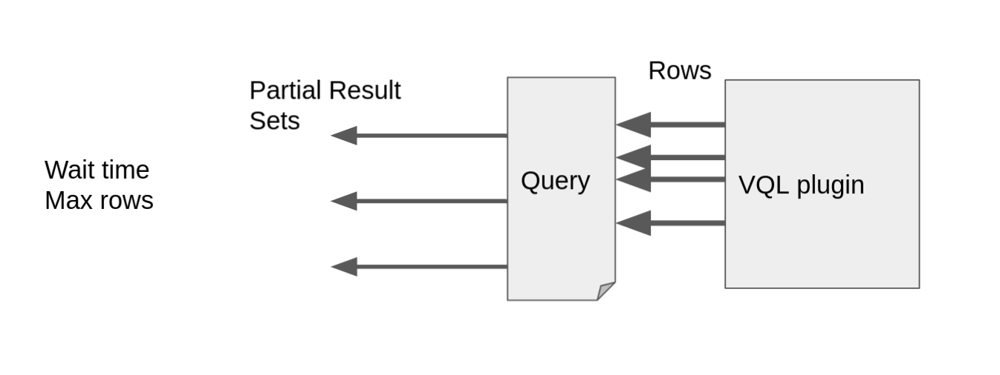
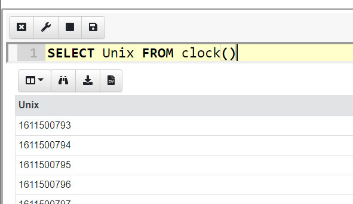

Normally a VQL query returns a result set and then terminates. For
example, consider the `glob()` plugin which searches the filesystem
for files matching a pattern. While it may take a few minutes to fully
traverse the entire filesystem, as soon as a matching file is found,
the row is emitted from the plugin asynchronously.

VQL queries are always asynchronous which means that as soon as
results are available, they are emitted into the query, and can
potentially be relayed back to the server - even if the plugin takes a
very long time to run.

Consider now a VQL plugin that takes a long time to complete, perhaps
even days. As soon as a result is available, a row will be emitted and
will be relayed to the server. Now what if the plugin emits a row
based on an event occurring?

When the event occurs, the plugin will asynchronously emit a row
describing the event, and go back to monitoring for the event
again. This type of plugin is called an `Event Plugin` because it
never terminates - instead it emits a row when an event occur. The
entire VQL query is blocked waiting for the event.

A Query that is waiting on an event (i.e. it is selecting from an
event plugin) is called an `Event Query`. Event queries do not
terminate on their own - they simply return partial results until
cancelled.



The diagram above illustrates how partial results are send to the
server. As events occur at random times on the endpoint, the event
plugin will emit rows into the query at random times. In order to
minimize frequent communicating with the server, the client will batch
rows into partial results sets which will be forwarded periodically to
the server.

## Example

You can get the feel of event queries by typing the following query
into a notebook

```sql
SELECT Unix FROM clock()
```

The `clock()` plugin simply emits one row per second. The GUI will be
waiting for the query to complete, showing partial results as it goes
along. Of course the query will not complete by itself, only when it
hits the notebook's 10 Minute timeout or the user clicks the `Stop`
<i class="fas fa-stop"></i> button.



To learn more about how Velociraptor uses event queries to monitor
events on endpoints, see [Client Monitoring]()
