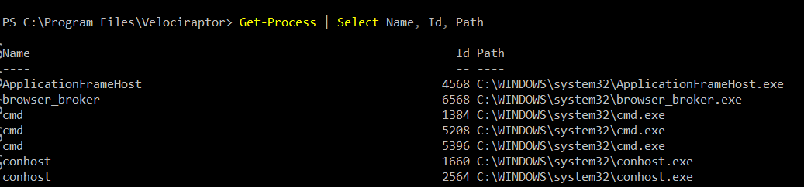
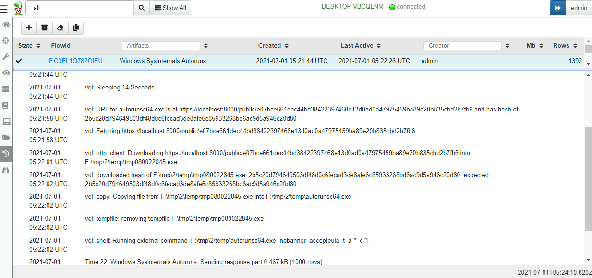

VQL is really a glue language - we rely on VQL plugins and functions
to do all the heavy lifting.  VQL was never designed to be an all
powerful language - users will hit the limits of what is possible in
VQL pretty quickly.

To take full advantage of the power of VQL, we need to be able to
easily extend its functionality. This section illustrates how VQL can
be extended by including powershell scripts and external binaries.

For the ultimate level of control and automation, the Velociraptor API
can be used to interface directly to the Velociraptor server utilizing
many supported languages (like Java, C++, C#, Python).

## Extending VQL - Artifacts

The most obvious way for extending VQL is simply writing additional
artifacts. We have seen this done extensively in previous pages: Once
an artifact is added to Velociraptor, other artifacts can easily reuse
it by simply calling it.

Artifacts serve to encapsulate VQL queries and allow us to build more
complex content, but ultimately we are still limited with the basic
capabilities of the VQL engine. Adding more artifacts can not extend
the basic functionality provided by the built in VQL plugins and
functions.

### Extending artifacts - PowerShell

Powershell is a powerful systems automation language mainly used on
Windows systems where is comes built in and almost always available.

Many complex software products contain powershell modules around
automation and system administration. It does not make sense for
Velociraptor to directly support complex software packages such as
Office365, Azure which already come with extensive powershell support.

But it is critical to be able to recover forensically relevant data
from these package. Therefore it makes sense to wrap powershell
scripts in VQL artifacts.

In the following we see how to wrap a simple powershell snippet in
VQL. The process for wrapping other powershell snippets is very
similar.

For this example we will use the following very simple snippet of
PowerShell which simply lists the names, process id and binary path of
all running processes.

```powershell
Get-Process | Select Name, Id, Path
```



In order to run powershell code from Velociraptor we will use the
`execve()` plugin to shell out to powershell. The `execve()` plugin
takes a list of args and builds a correctly escaped command line.

{}

The `execve()` plugin takes a **list** of command line arguments
(i.e. `argv`). Velociraptor will combine this list into a valid
command line by itself taking care to escape specific args (On
Windows). Do not attempt to construct this list from a single command
line string, since this will likely produce an opportunity for
[Command Line
Injection](https://owasp.org/www-community/attacks/Command_Injection)
if the commandline incorporates a user provided string.

Velociraptor minimizes the potential for this by requiring each
argument to be explicitly provided.

{}

Here is a simple artifact that runs the powershell script via `execve()`

```yaml
name: Custom.PowershellTest
sources:
  - precondition:
      SELECT OS From info() where OS = 'windows'

    query: |
        LET PowershellScript = '''Get-Process | SELECT Name, Id, Path'''
        SELECT * FROM execve(argv=["Powershell", "-ExecutionPolicy",
            "unrestricted", "-c", PowershellScript])
```


Collecting the artifact will result in the output of the powershell
script in an Stdout column.


{}

In the above artifact we relied on Velociraptor to properly escape the
powershell script to the powershell interpreter on the
commandline. For more reliable encoding, we can base64 encode the
script:

```sql
SELECT * FROM execve(argv=["Powershell", "-ExecutionPolicy",
 "unrestricted", "-EncodedCommand",
 base64encode(string=utf16_encode(string=PowershellScript))])
```

Alternative, we can write the Powershell script into a temporary file
and run it from there:

```sql
LET ps1 <= tempfile(extension=".ps1", data=PowershellScript)
SELECT * FROM execve(
  argv=["Powershell", "-ExecutionPolicy", "unrestricted", ps1)
```
{}

### Dealing with output

Using the `execve()` plugin we can see the output in the `Stdout`
column. However, it would be better to be able to deal with structured
output. Ideally we would like the powershell enabled artifact to
produce structured data that can be further processed by VQL.

We can use powershell's `ConvertTo-Json` to convert output to JSON,
and then use Velociraptor's `parse_json()` plugin to obtain structured
output.

```yaml
name: Custom.PowershellTest
sources:
  - precondition:
        SELECT OS From info() where OS = 'windows'

    query: |
        LET PowershellScript = '''Get-Process | SELECT Name, Id, Path | ConvertTo-Json'''
        SELECT * FROM foreach(
          row={
            SELECT Stdout FROM execve(argv=["Powershell", "-ExecutionPolicy",
                "unrestricted", "-c", PowershellScript], length=1000000)
          }, query={
            SELECT * FROM parse_json_array(data=Stdout)
        })
```

Normally the `execve()` plugin emits a row with the child process's
Stdout as soon as data is available. However in this case, splitting
the output will break the JSON string and prevent Velociraptor from
properly parsing it. Therefore, we supply the `length=1000000`
parameter indicating that Stdout will be buffered up to the specified
length before emitting the row.


Note how the output now appears as a regular table with rows and
columns. This allows VQL or operate on the result set as if it was
natively generated by a VQL plugin!

### Reusing powershell artifacts

Since our powershell script is now encapsulated, we can use it inside
other artifacts and plain VQL.  Users of this artifact dont care what
the PowerShell Script is or what it does - we have encapsulation!


## Remediation

Remediation means to restore the network from a compromised state -
Usually remove persistence, and clean up infected machines. Unlike
traditional DFIR work that focuses on detection with minimal
interference of the endpoint, remediation aims to modify the endpoint
in order to actively remove threats and harden the endpoint against
future compromise.

{}

Remediation is inherently risky! If a bug occurs that breaks the
endpoints, it is possible to damage the network quickly. Always
structure your artifacts so they show a dry run - what would have been
modified before actually performing the remediation. Always test your
remediation artifacts on selected endpoints before starting a wide
hunt everywhere.

{}

### Example: Remediate scheduled tasks

For this example we will schedule a task to run daily. This emulates a
common persistence used by malware to re-infect the machine daily,
even after the machine is cleaned up.

```ps1
SCHTASKS /CREATE /SC DAILY /TN "EvilTask" /TR "dir c:" /ST 20:01
```

First let us find our evil task by collecting the
`Windows.System.TaskScheduler` artifact.


Once we identify the malicious scheduled task we can remove it. An
example of such a remediation artifact is in
`Windows.Remediation.ScheduledTasks` artifact. Here is the relevant
VQL from that artifact.

```sql
SELECT * FROM foreach(row=tasks,
  query={
    SELECT * FROM if(condition= ReallyDoIt='Y',
      then={
        SELECT OSPath, Name, Command, Arguments, ComHandler, UserId, _XML
        FROM execve(argv=["powershell",
           "-ExecutionPolicy", "Unrestricted", "-encodedCommand",
              base64encode(string=utf16_encode(
              string=format(format=script, args=[Name])))
        ])
      }, else={
        SELECT OSPath, Name, Command, Arguments, ComHandler, UserId, _XML
        FROM scope()
      })
  })
```

Note the `ReallyDoIt` condition ensuring a dry run - if the parameter
is not set, the artifact will report all the tasks that match but will
not actually remove them.

We can perform a wider hunt to uncover potential malicious tasks and
see if any false positives will be found.

## Using external tools

Velociraptor is an extremely capable tool, but there will always be
situations where there will be a gap in its capabilities. We
previously saw how we can extend VQL using powershell, but what if we
have an external binary we would like to run on the endpoint?

We know how to shell out to an external binary using the `execve()`
plugin, but how do we ensure the binary exists on the endpoint in the
first place?

Velociraptor has the ability to manage external tools for artifacts
that need to use them:

* Velociraptor will ensure the tool is uploaded to the endpoint
* If the tool version is updated, Velociraptor will ensure the new version is used.
* Many artifacts need to use the same external binary each time, it
  makes sense to cache the binary on the endpoint so subsequent
  execution simply use the same binary.

As an admin, you can control aspects of this process, such as require
the tool to be downloaded from a certain URL (e.g. an S3 bucket).

As an artifact writer you can specify your artifact will use a certain
tool and provide a hint of where to download it from.

### The Autoruns artifact

We will go through an example to understand this process. Let's
consider the `Windows.Sysinternals.Autoruns` artifact. This is a
commonly used artifact that launches the `autorunsc.exe` binary
(looking for common malware persistence) on the endpoint, collects the
output and converts the results to a table.

1. The artifact defines an external tool by specifying the `tools`
   attribute. The most important part is the `name` field, naming the
   tool uniquely.

   We can also provide a URL where the binary will be downloaded from
   if required.

```sql
name: Windows.Sysinternals.Autoruns
tools:
  - name: Autorun_amd64
    url: https://live.sysinternals.com/tools/autorunsc64.exe
```

2. Next we call the `Generic.Utils.FetchBinary` artifact within the
   query in order to materialize the tool on the endpoint. In this
   case we fetch the correct tool based on the architecture.

```sql
sources:
  - query: |
      LET os_info <= SELECT Architecture FROM info()

      // Get the path to the binary.
      LET bin <= SELECT * FROM Artifact.Generic.Utils.FetchBinary(
              ToolName= "Autorun_" + os_info[0].Architecture,
              ToolInfo=ToolInfo)
```

3. Next we simply run the tool and collect its output.

```sql
      LET output = SELECT * FROM execve(argv=[
           bin[0].OSPath,
           '-nobanner', '-accepteula', '-t', '-a', '*', '-c', '*'],
           length=10000000)
```

Let's collect the artifact. Simply click "New collection" then search
for the autoruns artifact.


We immediately see the tools in the artifact description. These links
allow us to configure the tool. We can see the hash and the URL the
tool will be fetched from. The server keeps track of the binary hash
and requires it to match what was downloaded.


As an administrator we have the option to override the binary with our
own copy by uploading into the GUI. We can also provide an alternative
URL to serve the binary from.



Once the artifact is launched we can see how it works from the query
logs:

1. First the artifact waits for a random time in order to not
   overwhelm the server.
2. Next the endpoint will download the binary from a server provided
   URL. The server also tells the endpoint the tool's expected hash.
3. The endpoint compares the hash of the file it downloaded with the
   expected hash.
4. Once the hashes agree, the endpoint will copy the executable into
   the permanent cache directory.
5. The tool is now launched and the output parsed in VQL rows.


