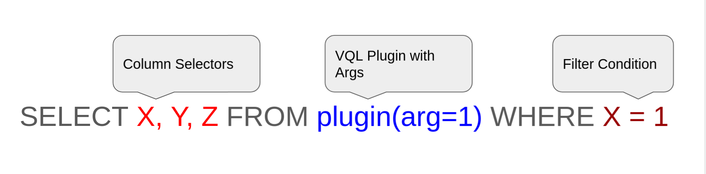
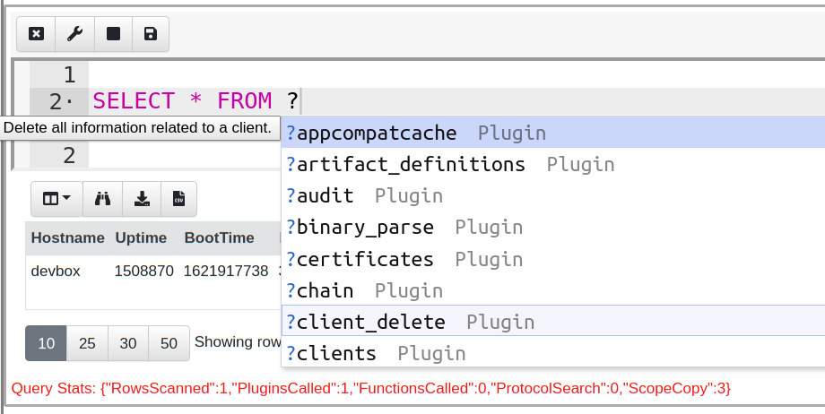
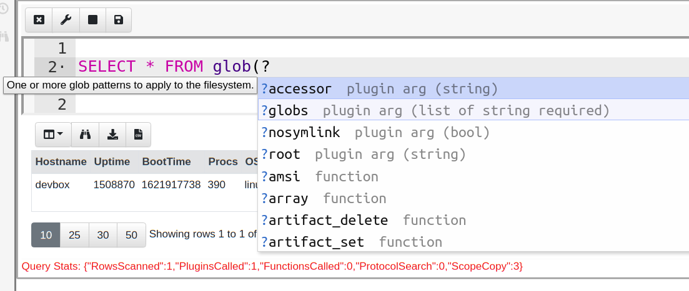
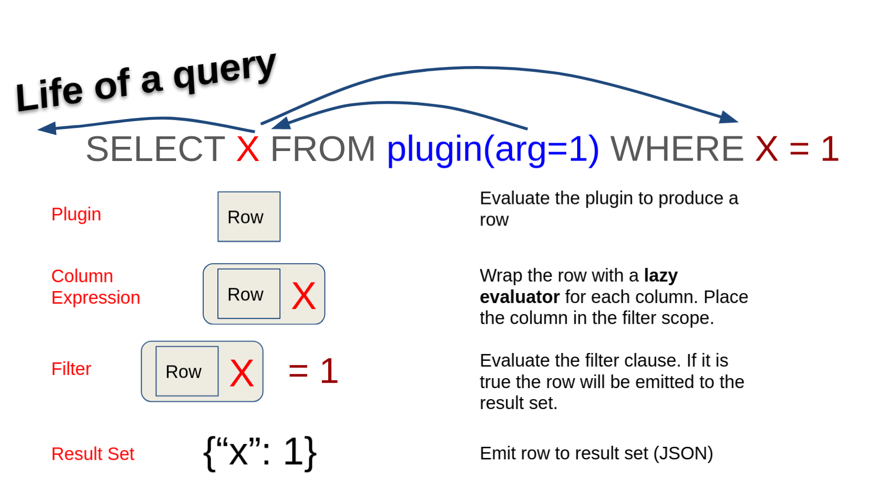
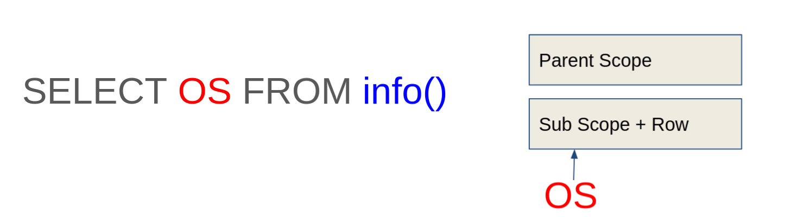
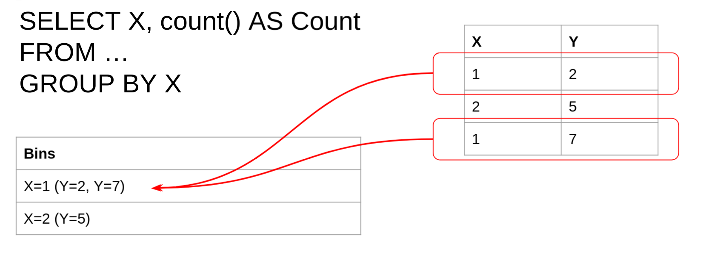
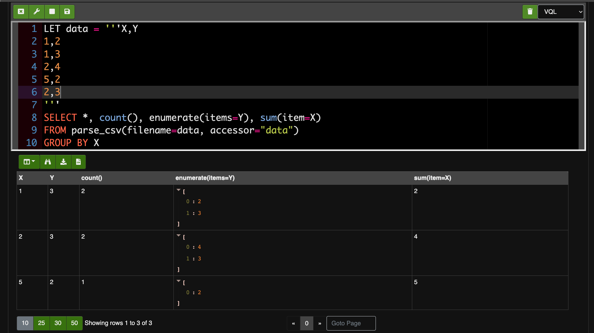

{}

When learning VQL, we recommend practicing in an environment where you can
easily debug, iterate, and interactively test each query.

You can read more about notebooks [here]().
For the purposes of this documentation, we will assume you've created a notebook
and are typing VQL into the cell.

{}

## Basic Syntax

VQL's syntax is heavily inspired by SQL. It uses the same basic
`SELECT .. FROM .. WHERE` sentence structure, but does not include the
more complex SQL syntax, such as `JOIN` or `HAVING`. In VQL, similar
functionality is provided through plugins, which keeps the syntax
simple and concise.

### Whitespace

VQL does not place any restrictions on the use of whitespace in the
query body. We generally prefer queries that are well indented because
they are more readable and look better but this is not a
requirement. Unlike SQL, VQL does not require or allow a semicolon `;`
at the end of statements.

The following two queries are equivalent

```vql
-- This query is all on the same line - not very readable but valid.
LET X = SELECT * FROM info() SELECT * FROM X

-- We prefer well indented queries but VQL does not mind.
LET X= SELECT * FROM info()
SELECT * FROM X
```

Let's consider the basic syntax of a VQL query.



The query starts with a SELECT keyword, followed by a list of `Column
Selectors` then the `FROM` keyword and a `VQL Plugin` potentially
taking arguments. Finally we have a `WHERE` keyword followed by a
filter expression.

### Plugins

While VQL syntax is similar to SQL, SQL was designed to work on static
tables in a database. In VQL, the data sources are not actually static
tables on disk - they are provided by code that runs to generate
rows. `VQL Plugins` produce rows and are positioned after the
`FROM` clause.

Like all code, VQL plugins use parameters to customize and control
their operations. VQL Syntax requires all arguments to be provided by
name (these are called keyword arguments). Depending on the specific
plugins, some arguments are required while some are optional.

{}

You can type `?` in the Notebook interface to view a
list of possible completions for a keyword. Completions are context sensitive. For example, since plugins must follow the `FROM` keyword, any suggestions
after the `FROM` keyword will be for VQL plugins. Typing `?` inside
a plugin arguments list shows the possible arguments, their
type, and if they are required or optional.





{}

### Life of a query

In order to understand how VQL works, let's follow a single row through the query.



1. Velociraptor's VQL engine will call the plugin and pass
   any relevant arguments to it. The plugin will then generate one or
   more rows and send a row at a time into the query for further
   processing.

2. The column expression in the query receives the
   row. However, instead of evaluating the column expression
   immediately, VQL wraps the column expression in a `Lazy
   Evaluator`. Lazy evaluators allow the actual evaluation of the
   column expression to be delayed until a later time.

3. Next, VQL takes the lazy evaluator and uses them to evaluate the
   filter condition, which will determine if the row is to be
   eliminated or passed on.

4. In this example, the filter condition (`X=1`) must evaluate the
   value of X and therefore will trigger the Lazy Evaluator.

5. Assuming X is indeed 1, the filter will return TRUE and the row
   will be emitted from the query.

### Lazy Evaluation

In the previous example, the VQL engine goes through signficant effort to postpone the evaluation as much as
possible. Delaying an evaluation is a recurring theme in VQL and it saves Velociraptor from performing unnecessary work, like evaluating a
column value if the entire row will be filtered out.

Understanding lazy evaluation is critical to writing efficient VQL
queries. Let's examine how this work using a series of
experiments. For these experiments we will use the `log()` VQL
function, which simply produces a log message when evaluated.

```sql
-- Case 1: One row and one log message
SELECT OS, log(message="I Ran!") AS Log
FROM info()

-- Case 2: No rows and no log messages
SELECT OS, log(message="I Ran!") AS Log
FROM info()
WHERE OS = "Unknown"

-- Case 3: Log message but no rows
SELECT OS, log(message="I Ran!") AS Log
FROM info()
WHERE Log AND OS = "Unknown"

-- Case 4: No rows and no log messages
SELECT OS, log(message="I Ran!") AS Log
FROM info()
WHERE OS = "Unknown" AND Log
```

In Case 1, a single row will be emitted by the query and the associated log function will be evaluated, producing a log message.

Case 2 adds a condition which should eliminate the row. **Because the
row is eliminated VQL can skip evaluation of the log()
function.** No log message will be produced.

Cases 3 and 4 illustrate VQL's evaluation order of `AND` terms - from
left to right with an early exit.

We can use this property to control when expensive functions are
evaluated e.g. `hash()` or `upload()`.

### What is a Scope?

Scope is a concept common in many languages, and it is also central in
VQL.  A scope is a bag of names that is used to resolve symbols,
functions and plugins in the query.

For example, consider the query

```sql
SELECT OS FROM info()
```

VQL sees “info” as a plugin and looks in the scope to get the real
implementation of the plugin.

Scopes can be nested, which means that in different parts of the query a
new child scope is used to evaluate the query. The child scope is
constructed by layering a new set of names over the top of the
previous set. When VQL tries to resolve a name, it looks up the scope
in reverse order going from layer to layer until the symbol is
resolved.

Take the following query for example,



VQL evaluates the `info()` plugin, which emits a single row. Then VQL
creates a child scope, with the row at the bottom level. When VQL tries
to resolve the symbol `OS` from the column expression, it examines the
scope stack in reverse, checking if the symbol `OS` exists in the
lower layer. If not, VQL checks the next layer, and so on.

{}

Columns produced by a plugin are added to the child scope and
therefore **mask** the same symbol name from parent scopes. This can
sometimes unintentionally hide variables of the same name which are
defined at a parent scope. If you find this happens to your query you
can rename earlier symbols using the `AS` keyword to avoid this
problem.  For example:

```sql
SELECT Pid, Name, {
   SELECT Name FROM pslist(pid=Ppid)
} AS ParentName
FROM pslist()
```

In this query, the symbol `Name` in the outer query will be resolved
from the rows emitted by `pslist()` but the second `Name` will be
resolved from the row emitted by `pslist(pid=Ppid)` - or in other
words, the parent's name.

{}

### String constants

Strings denoted by `"` or `'` can escape special characters using the
`\`. For example, `"\n"` means a new line. This is useful but it
also means that backslashes need to be escaped. This is sometimes
inconvenient, especially when dealing with Windows paths (that
contains a lot of backslashes).

Therefore, Velociraptor also offers a multi-line raw string which is
denoted by `'''` (three single quotes). Within this type of string no
escaping is possible, and the all characters are treated literally -
including new lines. You can use `'''` to denote multi line strings.

### Identifiers with spaces

In VQL an `Identifier` is the name of a column, member of a dict or a
keyword name. Sometimes identifiers contain special characters such as
space or `.` which make it difficult to specify them without having
VQL get confused by these extra characters.

In this case it is possible to enclose the identifier name with back
ticks (`` ` ``).

In the following example, the query specifies keywords with spaces to
the `dict()` plugin in order to create a dict with keys containing spaces.

The query then continues to extract the value from this key by
enclosing the name of the key using backticks.

```vql
LET X = SELECT dict(`A key with spaces`="String value") AS Dict
FROM scope()

SELECT Dict, Dict.`A key with spaces` FROM X
```

### Subqueries

VQL Subqueries can be specified as a column expression or as an
arguments. Subqueries are delimited by `{` and `}`. Subqueries are
also lazily evaluated, and will only be evaluated when necessary.

The following example demonstrates subqueries inside plugin args. The
`if()` plugin will evaluate the `then` or the `else` query depending
on the `condition` value (in this example when X has the value 1).

```vql
SELECT * FROM if(condition=X=1,
then={
  SELECT * FROM ...
},
else={
  SELECT * FROM ...
})
```

### Subqueries as columns

You can use a subquery as a column which will cause it to be evaluated
for each row (in this way it is similar to the `foreach()` plugin).

Since subqueries are always an array of dictionaries, the output if
often difficult to read when the subquery returns many rows or
columns. As a special case, VQL will simplify subqueries:

1. If the subquery returns one row and has several columns, VQL will
   put a single dictionary of data in the column.
2. If the subquery returns one row and a single column, the value is
   expanded into the cell.

These heuristics are helpful when constructing subqueries to enrich
columns. If you wish to preserve the array of dicts you can use a VQL
function instead.

Here is an example to demonstrate:
```vql
LET Foo =  SELECT "Hello" AS Greeting FROM scope()

SELECT { SELECT "Hello" AS Greeting FROM scope() } AS X,
       { SELECT "Hello" AS Greeting, "Goodbye" AS Farewell FROM scope() } AS Y,
       Foo AS Z
FROM scope()
```

In the above query - X is a subquery with a single row and a single
column, therefore VQL will simplify the column X to contain `"Hello"`
The second query contains two columns so VQL will simplify it into a
dict.

Finally to get the full unsimplified content, a VQL stored query can
be used. This will result in an array of one dict, containing a single
column `Greeting` with value of `Hello`


### Arrays

An array may be defined either by `(` and `)` or `[` and `]`. Since it
can be confusing to tell regular parenthesis from an array with a
single element, VQL also allows a trailing comma to indicate a single
element array. For example `(1, )` means an array with one member,
whereas `(1)` means a single value of 1.

### Dictionaries

A dictionary (or in short a `dict`) is an associative data structure
which associates keys with values. This is often called a `hash map`
in other languages.

VQL's dict appears in many places and used heavily internally. You can
recognize that a dict is involved using the `typeof()` VQL function.

Unlike some other languages, Velociraptor's dicts maintain their key
order. You can iterate over the dict's key value pairs using the
`items()` plugin:

```vql
LET MyDict <= dict(Foo=1, Bar=2, Baz=3)

SELECT * FROM items(item=MyDict)
```

The dict has a number of very useful attributes:

* `MyDict.Items`: Returns a list of key value pairs
* `MyDict.Keys`: Returns a list of keys
* `MyDict.Values`: Returns a list of Values
* `MyDict.Len`: Returns the number of keys
* `MyDict.ToMap`: Converts to an unordered map.
* `MyDict.String`: Converts to a JSON representation of the dict.


### The scope() plugin

VQL is strict about the syntax of a VQL statement. Each statement must
have a plugin specified, however sometimes we dont really want to
select from any plugin at all.

The default noop plugin is called `scope()` and simply returns the
current scope as a single row. If you even need to write a query but
do not want to actually run a plugin, use `scope()` as a noop
plugin. For example

```sql
-- Returns one row with Value=4
SELECT 2 + 2 AS Value
FROM scope()
```

## The Foreach plugin

VQL is modeled on basic SQL since SQL is a familiar language for new
users to pick up. However, SQL quickly becomes more complex with very
subtle syntax that only experienced SQL users use regularly. One of
the more complex aspects of SQL is the `JOIN` operator which typically
comes in multiple flavors with subtle differences (INNER JOIN, OUTER
JOIN, CROSS JOIN etc).

While these make sense for SQL since they affect the way indexes are
used in the query, VQL does not have table indexes, nor does it have
any tables. Therefore the `JOIN` operator is meaningless for
Velociraptor. To keep VQL simple and accessible, we specifically did
not implement a `JOIN` operator. For a more detailed discussion of the
`JOIN` operator see [emulating join in VQL]({})

Instead of a `JOIN` operator, VQL has the `foreach()` plugin, which is
probably the most commonly used plugin in VQL queries. The `foreach()`
plugin takes two arguments:

1. The `row` parameter is a subquery that provides rows

2. The `query` parameter is a subquery that will be evaluated on a
   subscope containing each row that is emitted by the `row` argument.

Consider the following query:

```sql
SELECT * FROM foreach(
    row={
        SELECT Exe FROM pslist(pid=getpid())
    },
    query={
        SELECT ModTime, Size, FullPath FROM stat(filename=Exe)
    })
```

Note how `Exe` is resolved from the produced row since the query is
evaluated within the nested scope.

Foreach is useful when we want to run a query on the output of another
query.

### Foreach on steroids

Normally foreach iterates over each row one at a time.  The
`foreach()` plugin also takes the workers parameter. If this is larger
than 1, `foreach()` will use multiple threads and evaluate the `query`
query in each worker thread. This allows the query to evaluate values in parallel.

For example, the following query retrieves all the
files in the System32 directory and calculates their hash.

```sql
SELECT FullPath, hash(path=FullPath)
FROM glob(globs="C:/Windows/system32/*")
WHERE NOT IsDir
```

As each row is emitted from the `glob()` plugin with a filename of a
file, the `hash()` function is evaluated and the hash is
calculated.

However this is linear, since each hash is calculated before the next
hash is started - hence only one hash is calculated at once.

This example is very suitable for parallelization because globbing for
all files is quite fast, but hashing the
files can be slow. If we delegate the hashing to multiple threads, we
can make more effective use of the CPU.

```sql
SELECT * FROM foreach(
row={
   SELECT FullPath
   FROM glob(globs="C:/Windows/system32/*")
   WHERE NOT IsDir
}, query={
   SELECT FullPath, hash(path=FullPath)
   FROM scope()
}, worker=10)

```

### Foreach and deconstructing a dict

Deconstructing a dict means to take that dict and create a column for
each field of that dict. Consider the following query:

```sql
LET Lines = '''Foo Bar
Hello World
Hi There
'''

LET all_lines = SELECT grok(grok="%{NOTSPACE:First} %{NOTSPACE:Second}", data=Line) AS Parsed
FROM parse_lines(accessor="data", filename=Lines)

SELECT * FROM foreach(row=all_lines, column="Parsed")
```

This query reads some lines (for example log lines) and applies a grok
expression to parse each line. The grok function will produce a dict
after parsing the line with fields determined by the grok expression.

The `all_lines` query will have one column called "Parsed" containing
a dict with two fields (First and Second). Using the `column`
parameter to the foreach() plugin, foreach will use the value in that
column as a row, deconstructing the dict into a table containing the
`First` and `Second` column.

## LET expressions

We know that subqueries can be used in various parts of
the query, such as in a column specifier or as an argument to a
plugin. While subqueries are convenient, they can become unwieldy when
nested too deeply. VQL offers an alternative to subqueries called
`Stored Queries`.

A stored query is a lazy evaluator of a query that we can store in
the scope.  Wherever the stored query is used it will be evaluated on
demand. Consider the example below, where for each process, we
evaluate the `stat()` plugin on the executable to check the
modification time of the executable file.

```sql
LET myprocess = SELECT Exe FROM pslist()

LET mystat = SELECT ModTime, Size, FullPath
        FROM stat(filename=Exe)

SELECT * FROM foreach(row=myprocess, query=mystat)
```

{}

A Stored Query is simply a query that is stored into a variable. It is
not actually evaluated at the point of definition. At the point where
the query is referred, that is where evaluation occurs. The scope at
which the query is evaluated is derived from the point of reference.

For example in the query above, `mystat` simply stores the query
itself. Velociraptor will then re-evaluate the `mystat` query for each
row given by `myprocess` as part of the `foreach()` plugin operation.

{}

### LET expressions are lazy

We have previously seen VQL goes out of its way to do as little work
as possible.

Consider the following query

```sql
LET myhashes = SELECT FullPath, hash(path=FullPath)
FROM glob(globs="C:/Windows/system32/*")

SELECT * FROM myhashes
LIMIT 5
```

The `myhashes` stored query hashes all files in System32 (many
thousands of files). However, this query is used in a second query
with a `LIMIT` clause.

When the query emits 5 rows in total, the entire query is cancelled
(since we do not need any more data) which in turn aborts the
`myhashes` query. Therefore, VQL is able to exit early from any query
without having to wait for the query to complete.

This is possible because VQL queries are **asynchronous** - we do
**not** calculate the entire result set of `myhashes` **before** using
`myhashes` in another query, we simply pass the query itself and
forward each row as needed.

### Materialized LET expressions

A stored query does not in itself evaluate the
query. Instead the query will be
evaluated whenever it is referenced.

Sometimes this is not what we want to do. For example consider a query
which takes a few seconds to run, but its output is not expected to
change quickly. In that case, we actually want to cache the results of
the query in memory and simply access it as an array.

Expanding a query into an array in memory is termed `Materializing`
the query.

For example, consider the following query that lists all sockets on
the machine, and attempts to resolve the process ID to a process name
using the `pslist()` plugin.

```sql
LET process_lookup = SELECT Pid AS ProcessPid, Name FROM pslist()

SELECT Laddr, Status, Pid, {
   SELECT Name FROM process_lookup
   WHERE Pid = ProcessPid
} AS ProcessName
FROM netstat()
```

This query will be very slow because the `process_lookup` stored query
will be re-evaluated for each row returned from netstat (that is, for each
socket).

The process listing will not likely change during the few seconds it takes the query to run.
It would be more efficient to have the process listing cached in memory
for the entire length of the query.

We recommend that you `Materialize` the query:

```sql
LET process_lookup <= SELECT Pid AS ProcessPid, Name FROM pslist()

SELECT Laddr, Status, Pid, {
   SELECT Name FROM process_lookup
   WHERE Pid = ProcessPid
} AS ProcessName
FROM netstat()
```

The difference between this query and the previous one is that
the `LET` clause uses `<=` instead of `=`. The `<=` is the materialize
operator. It tells VQL to expand the query in place into an array
which is then assigned to the variable `process_lookup`.

Subsequent accesses to `process_lookup` simply access an in-memory
array of pid and name for all processes and **do not** need to run
`pslist()` again.

## Local functions

`LET` expressions may store queries into a variable,
and have the queries evaluated in a subscope at the point of use.

A `LET` expression can also declare explicit passing of
variables.

Consider the following example which is identical to the example
above:

```sql
LET myprocess = SELECT Exe FROM pslist()

LET mystat(Exe) = SELECT ModTime, Size, FullPath
        FROM stat(filename=Exe)

SELECT * FROM foreach(row=myprocess, query={
  SELECT * FROM mystat(Exe=Exe)
})
```

This time `mystat` is declares as a `VQL Local Plugin` that
takes arguments. Therefore we now pass it an parameter explicitly and
it behaves as a plugin.

Similarly we can define a `VQL Local Function`.

```sql
LET MyFunc(X) = X + 5

-- Return 11
SELECT MyFunc(X=6) FROM scope()
```

{}

Remember the difference between a VQL plugin and a VQL function is
that a plugin returns multiple rows and therefore needs to appear
between the FROM and WHERE clauses. A function simply takes several
values and transforms them into a single value.

{}

## VQL Operators

In VQL an operator represents an operation to be taken on
operands. Unlike SQL, VQL keeps the number of operators down,
preferring to use VQL functions over introducing new operators.

The following operators are available. Most operators apply to two
operands, one on the left and one on the right (so in the expression
`1 + 2` we say that `1` is the Left Hand Side (`LHS`), `2` is the Right
Hand Side (`RHS`) and `+` is the operator.

|Operator|Meaning|
|--------|-------|
|`+ - * /`| These are the usual arithmetic operators |
|`=~` | This is the regex operator, reads like "matches". For example `X =~ "Windows"` will return `TRUE` if X matches the regex "Windows"|
|`!= = < <= > >=` | The usual comparison operators. |
|`in` | The membership operator. Returns TRUE if the LHS is present in the RHS. Note that `in` is an exact case sensitive match|
|`.`| The `.` operator is called the Associative operator. It dereferences a field from the LHS named by the RHS. For example `X.Y` extracts the field `Y` from the dict `X`|

### Protocols

When VQL encounters an operator it needs to decide how to actually
evaluate the operator. This depends on what types the LHS and RHS
operands actually are. The way in which operators interact with the
types of operands is called a `protocol`.

Generally VQL does the expected thing but it is valuable to understand
which protocol will be chosen in specific cases.

### Example - Regex operator

For example consider the following query

```vql
LET MyArray = ("X", "XY", "Y")
LET MyValue = "X"
LET MyInteger = 5

SELECT MyArray =~ "X", MyValue =~ "X", MyInteger =~ "5"
FROM scope()
```

In the first case the regex operator is applied to an array so the
expression is true if **any** member of the array matches the regular
expression.

The second case applied the regex to a string, so it is true if the
string matches.

Finally in the last case, the regex is applied to an integer. It makes
no sense to apply a regular expression to an integer and so VQL
returns FALSE.

### Example - Associative operator applied on a stored query

The Associative operator is denoted by `.` and accesses a field from
an object or dict. One of the interesting protocols of the `.`
operator is when it is applied to a query or a list.

In the following example, I define a stored query that calls the
`Generic.Utils.FetchBinary` artifact (This artifact fetches the named
binary):

```vql
LET binary = SELECT FullPath
  FROM Artifact.Generic.Utils.FetchBinary(ToolName="ToolName")
```

Although a query defined via the `LET` keyword does not actually run
the query immediately (it is a lazy operator), we can think of the
variable `binary` as containing an array of dictionaries
(e.g. `[{"FullPath": "C:\Windows\Temp\binary.exe"}]`).

If we now apply the associative operator `.` to the variable binary,
the operator will convert the array into another array, where each
member is extracted for example `binary.FullPath` is
`["C:\Windows\Temp\binary.exe"]`. To access the name of the binary we
can then index the first element from the array.


```vql
SELECT * FROM execve(argv=[binary.FullPath[0], "-flag"])
```

{}

While using the `.` operator is useful to apply to a stored query, care
must be taken that the query is not too large. In VQL stored queries
are lazy and do not actually execute until needed because they can
generate thousands of rows! The `.` operator expands the query into an
array and may exhaust memory doing so.

The following query may be disastrous:

```vql
LET MFT = SELECT * FROM Artifact.Windows.NTFS.MFT()

SELECT MFT.FullPath FROM scope()
```

The `Windows.NTFS.MFT` artifact typically generates millions of rows,
and `MFT.FullPath` will expand them all into memory!

{}

## VQL control structures

Let's summarizes some of the more frequent VQL control structures.

We already met with the `foreach()` plugin before. The `row` parameter
can also receive any iterable type (like an array).

### Looping over rows

VQL does not have a JOIN operator - we use the foreach plugin to
iterate over the results of one query and apply a second query on it.

```sql
SELECT * FROM foreach(
    row={ <sub query goes here> },
    query={ <sub query goes here >})
```

### Looping over arrays

Sometimes arrays are present in column data. We can iterate over these
using the foreach plugin.

```sql
SELECT * FROM foreach(
    row=<An iterable type>,
    query={ <sub query goes here >})
```

If row is an array, the value will be assigned to `_value` as a special placeholder.


### Conditional: if plugin and function

The `if()` plugin and function allows branching in VQL.

```sql
SELECT * FROM if(
    condition=<sub query or value>,
    then={ <sub query goes here >},
    else={ <sub query goes here >})
```

If the condition is a query it is true if it returns any rows. Next, we'll
evaluate the `then` subquery or the `else` subquery. Note that as usual,
VQL is lazy and will not evaluate the unused query or expression.

### Conditional: switch plugin

The `switch()` plugin and function allows multiple branching in VQL.

```sql
SELECT * FROM switch(
    a={ <sub query >},
    b={ <sub query >},
    c={ <sub query >})
```

Evaluate all subqueries in order and when any of them returns any rows
we stop evaluation the rest of the queries.


As usual VQL is lazy - this means that branches that are not taken are
essentially free!

### Conditional: chain plugin

The `chain()` plugin allows multiple queries to be combined.

```sql
SELECT * FROM chain(
    a={ <sub query >},
    b={ <sub query >},
    c={ <sub query >})
```

Evaluate all subqueries in order and append all the rows together.

## Group by clause

A common need in VQL is to use the `GROUP BY` clause to stack all rows
which have the same value, but what exactly does the `GROUP BY` clause
do?

As the name suggests, `GROUP BY` splits all the rows into groups
called bins where each bin has the same value of as the target
expression.



Consider the query in the example above, the `GROUP BY` clause
specifies that rows will be grouped where each bin has the same value
of the `X` column. Using the same table, we can see the first group
having `X=1` contains 2 rows, while the second group having `X=2`
contains only a single row.

The `GROUP BY` query will therefore return two rows (one for each
bin). Each row will contain a single value for the `X` value and one
of the `Y` values.

{}

As the above diagram illustrates, it only makes sense in general to
select the same column as is being grouped. This is because other
columns may contain any number of values, but only a single one of
these values will be returned.

In the above example, selecting the `Y` column is not deterministic
because the first bin contains several values for `Y`.

Be careful not to rely on the order of rows in each bin.

{}

### Aggregate functions

Aggregate VQL functions are designed to work with the `GROUP BY`
clause to operate on all the rows in each bin separately.

Aggregate functions keep state between evaluations. For example
consider the `count()` function. Each time count() is evaluated, it
increments a number in its own state.

Aggregate function State is kept in an `Aggregate Context` - a
separate context for each `GROUP BY` bin. Therefore, the following
query will produce a count of all the rows in each bin (because each
bin has a separate state).

```sql
SELECT X, count() AS Count
FROM …
GROUP BY X
```

Aggregate functions are used to calculate values that consider
multiple rows.

Some aggregate functions:

* `count()` counts the total number of rows in each bin.
* `sum()` adds up a value for an expression in each bin.
* `enumerate()` collect all the values in each bin into an in-memory array.
* `rate()` calculates a rate (first order derivative) between each
  invocation and its previous one.

These can be seen in the query below.



### VQL Lambda functions

In various places it is possible to specify a VQL lambda
function. These functions a simple VQL expressions which can be used
as filters, or simple callbacks in some plugins. The format is simple:

```
x=>x.Field + 2
```

Represents a simple function with a single parameter `x`. When the
lambda function is evaluated, the caller will pass the value as `x`
and receive the result of the function.

Usually lambda functions are specified as strings, and will be
interpreted at run time. For example the `eval()` function allows a
lambda to be directly evaluated (with `x` being the current scope in
that case).


```vql
SELECT eval(func="x=>1+1") AS Two FROM scope()
```

The scope that is visited at the place where the lambda is evaluated
will be passed to the lambda function - this allows the lambda to
access previously defined helper functions.

```vql
LET AddTwo(x) = x + 2

SELECT eval(func="x=>AddTwo(x=1)") AS Three FROM scope()
```

### VQL Error handling

VQL queries may encounter errors during their execution. For example,
we might try to open a file, but fail due to insufficient permissions.

It is especially not desirable to have VQL stop execution completely
and abort when an error occurs. Usually we want the query to continue
and produce as much data as possible. However, we do want to
know that some things potentially went wrong.

Therefore VQL functions typically return `NULL` in the case of an
error, and log the error in the `Query Logs`. These logs are visible
in a number of places:

1. When collecting an artifact from a client, the query logs are
   visible in the `Logs` tab.
2. In a notebook cell the query logs are visible by clicking the
   `Logs` button at the bottom of the cell.
3. With the API the query logs are returned in a separate response
   field.

When writing a VQL query, another aspect to think about is: what do we
define as an error? For example if we write a VQL query to collect a
bunch of files, but one of these files is unreadable - do we consider
the query has failed?  Should we just stop?

It really depends on a case by case basis.

Generally when collecting an artifact, a number of error conditions
might occur and some query logs will be produced. But the collection
is not automatically marked as an `Error` unless one of the following
conditions is met:

1. Any logs are emitted at the `ERROR` level (using the `log()`
   function with `level='ERROR'`).
2. Any log messages match the error patterns defined in
   [Frontend.collection_error_regex](https://docs.velociraptor.app/docs/deployment/references/#Frontend.collection_error_regex). By
   default this includes `Symbol not found` which usually indicates a
   mistake or typo with the VQL query itself.
3. Errors produced by the client itself (e.g. the query canceled or timed out)

When a collection indicates an error all it means is that something
unexpected happened and a user needs to take a closer look. The
collection may still contain useful data - it is a judgment call.

Therefore when writing your own VQL think if an error is actually
something we need to alert the user about (i.e. there is no further
value in the collection) or can we just log the error and move on.

Conversely as a Velociraptor user, when a collection is completed
without an error it does not necessarily mean that everything worked
perfectly - there may be some messages in the query logs that alert to
some errors encountered. You should always take a quick look at the
error logs to see if there is anything of concern.


{}

Note that an error may be temporary (e.g. the artifact collection
timed out), or permanent (e.g. an error within the VQL itself, file
not found etc).

It is not a good idea to automatically retry a collection unless you
are sure the error is temporary - if the error is more permanent the
same thing will happen again. It is always worth checking the query
logs to make sure there is any point in retrying the collection.

{}
