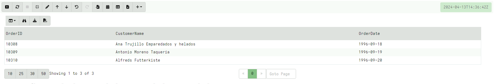

As mentioned previously, VQL does not support the `JOIN` operator. If
you are coming from a background in SQL you might be wondering how to
emulate a `JOIN` in VQL?

## What is SQL JOIN anyway?

First what are `JOIN` operations in SQL?

In `SQL`, a `JOIN` is used to combine rows from two or more tables,
based on a related column between them.

To better understand SQL JOIN, we can work through an
[example](https://www.w3schools.com/sql/sql_join.asp) of a `JOIN` SQL
query:

```sql
SELECT Orders.OrderID, Customers.CustomerName, Orders.OrderDate
FROM Orders
INNER JOIN Customers ON Orders.CustomerID=Customers.CustomerID;
```

The above SQL query selects rows from the `Customers` table matching
with rows in the `Orders` table, where the `CustomerID` field is the
same.

Replicating the example at
[www.w3schools.com](https://www.w3schools.com/sql/sql_join.asp),
assume the `Order` table is

|OrderID|CustomerID|OrderDate |
|-------|----------|----------|
|10308  |         2|1996-09-18|
|10309  |         3|1996-09-19|
|10310  |         1|1996-09-20|

And the `Customers` table is:

|CustomerID|CustomerName|ContactName|Country|
|----------|------------|-----------|-------|
|1|Alfreds Futterkiste|Maria Anders|Germany|
|2|Ana Trujillo Emparedados y helados|Ana Trujillo|Mexico|
|3|Antonio Moreno Taquería|Antonio Moreno|Mexico|


Let's think about how to calculate our SQL query, which joins the two
tables on the `CustomerID` column.

One very naive approach is:

1. Start with the `Orders` table, taking the first row:

|OrderID|CustomerID|OrderDate |
|-------|----------|----------|
|10308  |         2|1996-09-18|


2. Now scan the `Customers` table looking for a row where `CustomerID`
   is equal to 2, giving:

|CustomerID|CustomerName|ContactName|Country|
|----------|------------|-----------|-------|
|2         |Ana Trujillo Emparedados y helados|Ana Trujillo|Mexico|

3. Next we select the `OrderID` and `OrderDate` from the first table
   and `CustomerName` from the second table.

4. We then go back to step 1, choosing the next row in the `Orders`
   table, scanning the `Customers` table again etc, until all the
   orders are calculated.

Calculating the `JOIN` operation using the above algorithm is obvious
not efficient: If there are `N` rows in the `Orders` table, and `M`
rows in the `Customers` table, we will need to scan on the order of `N
x M` rows. As the size of the tables increases this complexity grows
substantially.

Usually in `SQL` tables, we can add an index though. An index allows
us to find a row very quickly. For example, if there is an index on
the `CustomerID` column in the `Customers` table we can retrieve the
row with a given `CustomerID` in constant time. This speeds up the
operation significantly as we only need to process `N` rows instead of
`N x M`.

The `SQL Query Optimiser` is a part of the SQL engine which plans the
Query execution in such a way as to make best use of all available
indexes. Therefore in SQL, a JOIN operation allows the database to
utilize indexes to make the query much faster.

## Using JOIN in VQL

In the previous example we saw exactly what a `JOIN` operation looks
like in `SQL` and how the database can utilize indexes to make the
operation very fast. In VQL, however all data is dynamic because our
data sources are plugins which calculate rows on the fly. Because we
dont have a static table, it means that we can not have a permanent
index on this data.

Therefore, VQL does not have indexes! As such, there is no benefit in
a query optimizer because there are no indexes to leverage! In VQL,
what you see is what you get - the query is executed exactly how it is
written.

Let's work through the exact same example as above and see how the
same `JOIN` operation can be done in VQL. You should replicate the
following yourself by copying the VQL into a notebook and getting the
feel of how these queries operate.

First we will load the tables as CSV files

```vql
LET OrdersTable = SELECT *
  FROM parse_csv(accessor="data", filename='''
OrderID,CustomerID,OrderDate
10308,2,1996-09-18
10309,3,1996-09-19
10310,1,1996-09-20
''')

LET CustomersTable = SELECT *
  FROM parse_csv(accessor="data", filename='''
CustomerID,CustomerName,ContactName,Country
1,Alfreds Futterkiste,Maria Anders,Germany
2,Ana Trujillo Emparedados y helados,Ana Trujillo,Mexico
3,Antonio Moreno Taquería,Antonio Moreno,Mexico
''')
```

Next we implement the naive algorithm as described above: For each
row in the `Orders` table we find the row in the `Customers` table
with the same `CustomerID`:

```vql
SELECT * FROM foreach(row={
  SELECT *, CustomerID AS Orders_CustomerID
  FROM OrdersTable
}, query={
  SELECT OrderID, CustomerName, OrderDate
  FROM CustomersTable
  WHERE CustomerID = Orders_CustomerID
})
```



## What about indexes?

The previous discussion showed how a JOIN in SQL is equivalent to a
`foreach()` VQL query, and admittedly even in SQL when there are no
indexes, the database will resort to a row scan yielding similarly bad
performance.

However, the advantage of SQL is in having indexes on tables! When an
index is present, the JOIN operation will be very fast because step 2
in the above algorithm can utilize the index to quickly find the row
with the required CustomerID.

Although VQL does not have permanent indexes (because the data is
usually dynamic) it is possible to create an index **for the duration
of the query**.

In VQL the index is provided by the `memoize()` function. This
function builds an index on the output of a query and retrieves a row
based on the index very quickly. Currently the index is in memory but
in future versions it may be file backed if needed.

Let's use an index to speed up the `foreach()` query in the example
above.

```vql
LET CustomerIDLookup <= memoize(
  key="CustomerID",
  query={
    SELECT CustomerID, CustomerName
    FROM Customers
  }, period=10000)
```

This builds an index of the `Customers` table keyed on the `CustomerID`
key. Since VQL data can be dynamic, the `memoize()` function allows to
define a freshness lifetime. After this period the index is discarded
and rebuilt. This allows VQL queries to adapt to evolving conditions
on the endpoint.

Now we can adapt the above algorithm:

1. Scan the `Orders` table
2. Select the `OrderID` and `OrderDate` for each order,
3. Fetch the row in the `Customers` table using the `CustomerID` index
4. Add the additional `CustomerName` column

```vql
SELECT OrderID, OrderDate,
    get(item=CustomerIDLookup, field=CustomerID).CustomerName AS CustomerName
FROM OrdersTable
```

## What about other types of JOIN?

There are several variations of the `JOIN` operator but they all
basically boil down to looking up indexes (this is ultimately what the
database engine does anyway).

For example an `INNER JOIN` returns all the Orders as long as they do
have a Customer associated with them:

```vql
SELECT OrderID, OrderDate,
    get(item=CustomerIDLookup, field=CustomerID).CustomerName AS CustomerName
FROM OrdersTable
WHERE get(item=CustomerIDLookup, field=CustomerID)
```

## How does this compare to SQL?

The important takeaway from this article is that the main difference
between SQL and VQL are not due to the limitations in the languages,
but because the basic assumptions are different. SQL operates on
static tables with data that does not change. Therefore it is possible
to build long lived indexes that can be queried many times.

With dynamic data this is not possible - indexes need to be rebuilt on
the fly for the duration of the query. For example if we want to
lookup a process by PID, we have to `memoize()` the process listing at
the start of the query, then query it multiple times during the rest
of the query. We need to be aware that processes start and stop all
the time, hence the process listing will become stale so will need to
be refreshed.

Building the indexes takes a certain amount of time so it only makes
sense if they will be frequently queried.
