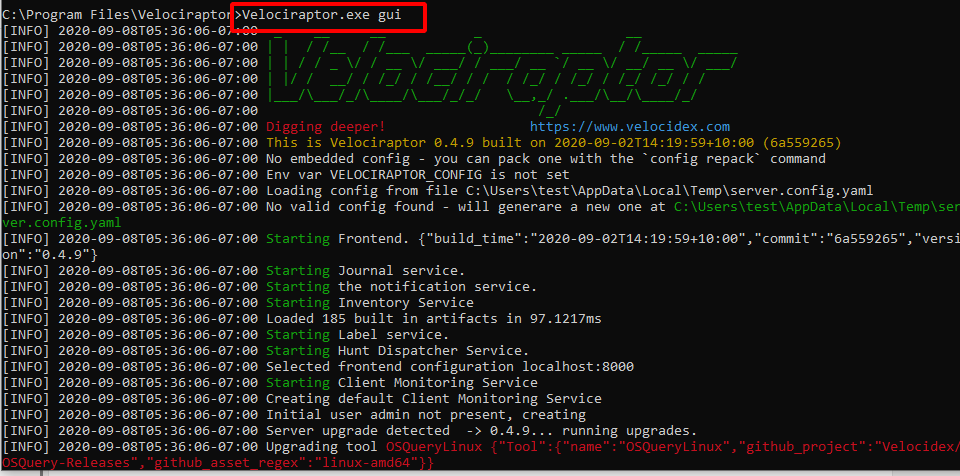
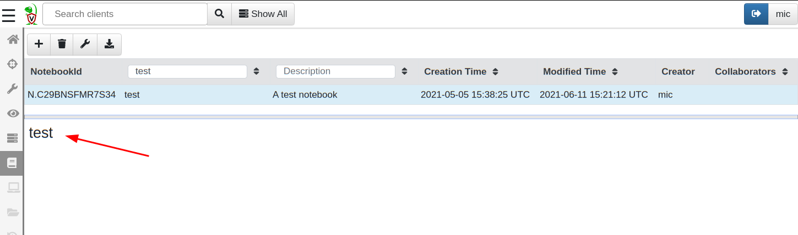
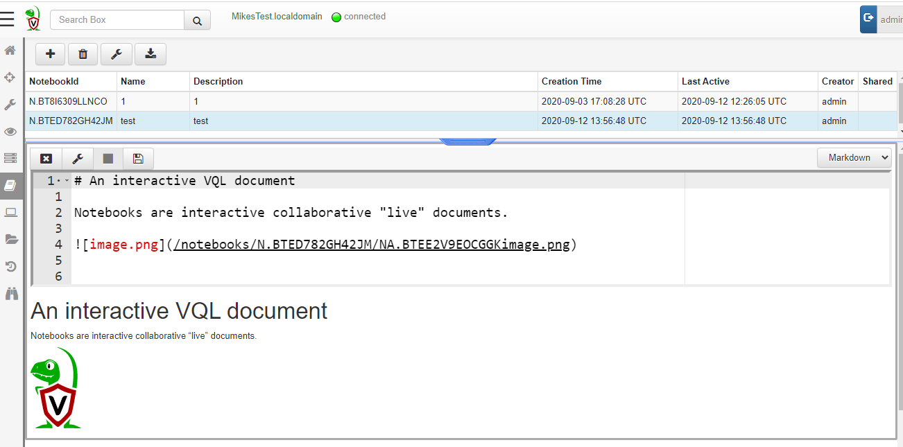
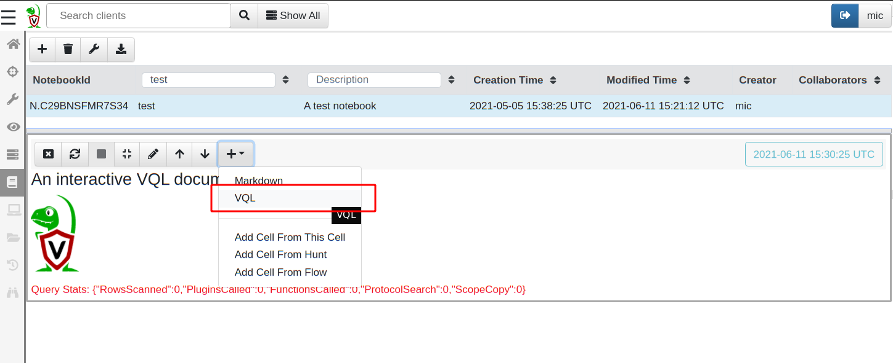
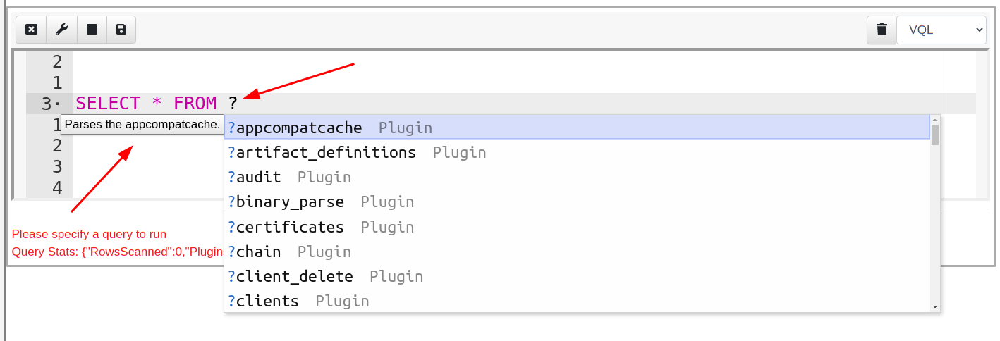
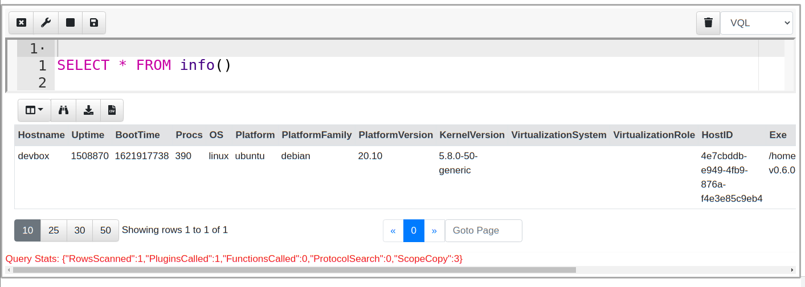
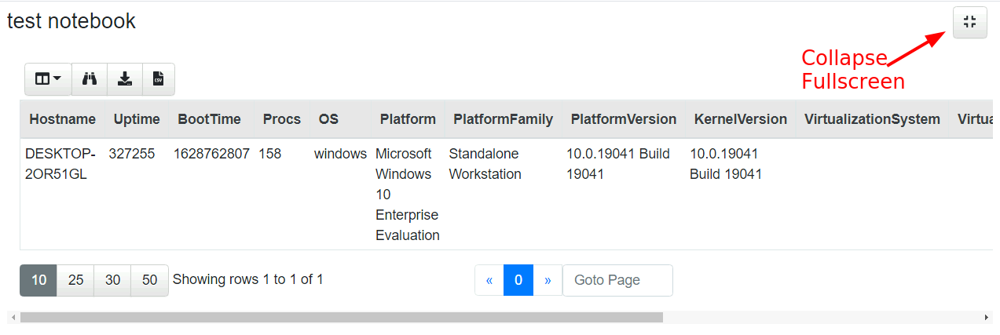
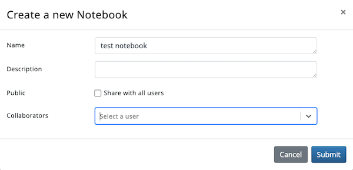

Notebooks are interactive collaborative documents which can interleave
markdown and VQL queries in to create an interactive report. Notebooks
are typically used to track and post process one or more hunts or
collaborate on an investigation.

Let's create a notebook to see the feature at work.

1. Start the Velociraptor GUI. You can do so easily by running
   `velociraptor.exe gui`. This will create a new server configuration
   and start a new server on the local machine. It will also start a
   local client communicating with the server.



2. Select Notebooks <i class="fas fa-book"></i> from the sidebar menu then "Add Notebook" <i class="fas fa-plus"></i>.

3. Give the notebook a name and a description and submit. The new
   notebook is created.



{}

A notebook consists of cells which may be edited. However, when not in
focus a cell has no decorations in order to appear as a seamless part
of a larger document. You have to click the cell into focus to be able
to see it's controls.

{}

4. Click on the cell to give it focus and the cell control toolbar
   will be shown, from here click the `Edit Cell` <i class="fas
   fa-pencil-alt"></i> button to edit the cell contents.



There are two types of cells: A `Markdown` cell receives markdown text
and renders HTML while a `VQL` cell can receive VQL queries. The cell
type is shown on the right hand side of the cell toolbar. You may
change cells from one type to the other at any time.

5. Lets add a new cell to the notebook. Click the `Add Cell` button <i
   class="fas fa-plus"></i> and a pull down menu appears offering the
   type of Cell that can be added. For now, select a `VQL` cell.



After clicking the `Edit Cell` button, you can type VQL directory into
the cell. As you type, the GUI offers context sensitive suggestions
about what possible completions can appear at the cursor. Typing "?"
will show all suggestions possible.

{}

Suggestions are context sensitive, so VQL plugins which can only
appear after a `FROM` clause will only be suggested when the cursor
appears are FROM.

{}



Lets type the following VQL query into the VQL cell.

```sql
SELECT * FROM info()
```




{}

The notebook may be switched into full screen to better emulate a full
notebook. With this setting, the notebook takes up the entire width of
the screen. You can switch back to the pane view by clicking on the
collapse button at the top right of the screen.



{}


## Hunt and Flow Notebooks

Notebooks are an excellent medium to run arbitrary VQL queries. Much
of the time, these queries are used to post process the results from
collections or hunts.

Therefore Velociraptor automatically creates a `hunt notebook` for
each hunt and a `flow notebook` for each collection. Let's see this
feature in action. I will collect the `Windows.Timeline.Prefetch`
artifact that will build a timeline of the prefetch files on the
endpoint.

## Sharing Notebooks

By default, notebooks are private to the user who created them. 
When creating or editing a notebook, you can choose to share it with
all users by clicking the Public check box. You can also share it with
only some users by selecting their names in the Collaborators field.



{}
Users can only view notebooks that they own or share.
Other notebooks cannot be accessed from the list view
or via direct link. However, the data within notebooks is still available
to all users. For example, any notebook editor can build or view a
[timeline]()
from private notebook cells if they know the notebook and cell IDs. This can
be useful for providing your team with data views that are sourced from more
complex queries maintained in a private notebook.
{}
