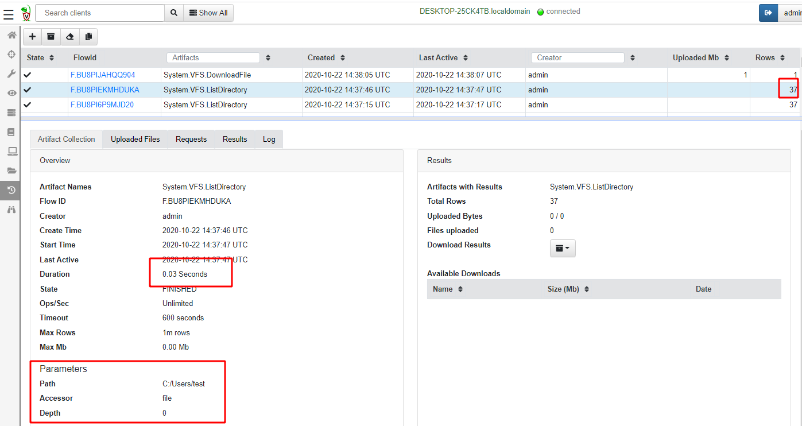
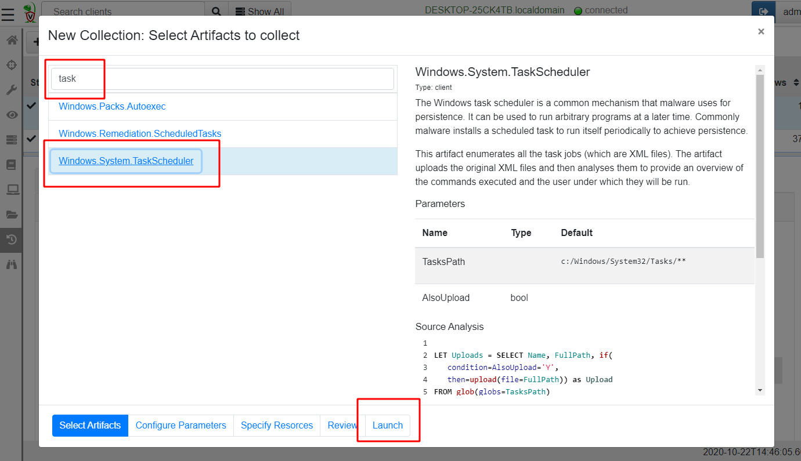
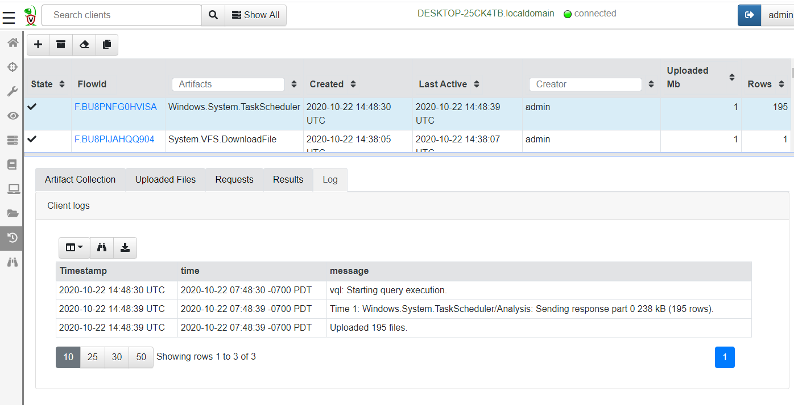

We have previously mentioned that Velociraptor's superpower is a
powerful query language termed `VQL`. How do we use VQL to query the
endpoints?

You might be surprised to learn that you have already been using VQL
all this time. When clicking in the VFS interface to sync a directory
listing or download files, the GUI was collecting artifacts behind the
scenes.

Click on the `Collected Artifacts` sidebar screen to view the
artifacts that have been collected so far.

This screen consists of two panes - the top pane shows a list of all
the `Artifacts` collected so far from this endpoint, while the bottom
pane shows information about the selected artifact.

We can immediately recognize that artifacts have a **Name** - in this
case we have been collecting `System.VFS.DownloadFile` and
`System.VFS.ListDirectory` in order to populate the VFS screen.

Each collection of these artifacts has a unique `Flow ID` which is how
Velociraptor refers to this collection. The collection is created at a
certain time and starts some time later (if the client is not
presently connected then the client will start the collection when it
comes back online).

Collections also take parameters - you can recognize in the above
example that the `System.VFS.ListDirectory` artifact was used to list
the directory "C:\\Users\\test".

Finally you can see that a collection can return rows or upload
files. This is because an artifact is simply a VQL query - and all
queries simply return a sequence of rows.

## What are Artifacts?

Ultimately Velociraptor is simply a VQL engine - i.e. it processes a
VQL query producing a series of rows and then sending those rows to
the server.

An `Artifact` is a way for us to package one or more VQL queries in a
human readable YAML file, provide it with a name and allow users to
collect it. An Artifact file simply embodies the query required to
collect or answer a specific question about the endpoint.

{}

The whole point of Artifacts is to encapsulate a VQL query inside a
YAML file, so that end users so not need to understand the query to be
able to use it. This makes artifacts easier to use and facilitates
knowledge sharing with more experienced users.

{}

### Example - collect Scheduled Tasks from endpoint.

To illustrate how artifacts can be used, let's collect a common
forensic artifact from our Windows endpoint. Windows allows commands
to be scheduled in the future. These tasks are typically stored in the
`C:\\Windows\\System32\\Tasks` directory as XML files.

While it is nice to know the details behind where the scheduled tasks
are stored and how to parse them - this is completely unnecessary with
Velociraptor, since we have a built-in artifact ready to collect these
tasks!

Start a new collection by clicking the `New Collection` button <i class="fas fa-plus"></i>. This will open the new collection wizard as show below.

The Wizard contains a number of steps but you can skip them if they are not needed.

In the first step, we search for an artifact to collect the type of
information we are after. In this case we start searching for task and
see our `Windows.System.TaskScheduler` artifact.

The next step allows us to tweak any of the artifact parameters.

Artifacts can take parameters and each parameter has a default value.

In this case we will choose to also upload the raw XML files. We just
click `Launch` to start the collection. After a short time, the
collection will complete.

We can see that this collection uploaded 195 files and added 195
rows. The VQL query parses each XML file in turn and uploads it.

We can see more information about this collection in the tabs in the
bottom pane:

1. Logs - As the VQL query is executing on the endpoint, the query may
   produce log messages. This is called the `Query Log` and it is
   forwarded to the server. We are able to see how the query is
   progressing based on the query log.

2. Uploaded Files - This tab shows all the files uploaded by this
   query. You can download any of these files from the server by
   simply clicking the link.

3. The Result Tab - shows each result set in a table. A single
   collection may collect several artifacts. In this case you can
   choose which artifact to view by clicking the pull down menu.

## Inspecting and modifying artifacts

The `View Artifacts` screen allows you to search and find all
artifacts loaded into Velociraptor. Search for an artifact in the
search screen and select an artifact to view.

The left pane shows the name of the artifact, a description and any
parameters the artifact may take. Finally we can inspect the VQL
source of the artifact.

You can edit any artifact by clicking the "Edit an Artifact" button <i class="fas fa-pencil-alt"></i>

User artifacts must have the prefix “Custom.” in order to ensure that
user artifacts do not override built in artifacts. When editing an
existing artifact, Velociraptor will automatically add the Custom
prefix to the artifact name and will produce a new artifact. Therefore
both the custom and built in artifact exist in Velociraptor at the
same time. This allows you to collect either the original or the
customized version as you please.

## Learn more

To learn more about how to write your own artifacts click TODO
