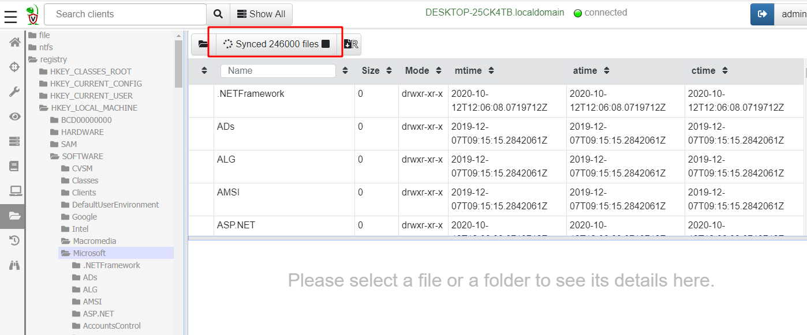

Once we selected a client, we often want to quickly look at the
client's filesystem. The Velociraptor GUI has a Virtual Filesystem
View (VFS) screen.

The VFS is simply a server side cache of the files on the endpoint. It
is merely a familiar GUI to allow inspection of the client's
filesystem.

The VFS consists of a tree view in the left pane and a file listing in
the top right pane. The tree view allows us to navigate through the
filesystem, starting at the top level. Remember that the GUI is simply
viewing data that was previously collected from the client. When
clicking on a directory in the tree view that has not been synced from
the client yet, the top right pane is blank.

Clicking on the refresh directory button <i class="fas fa-folder-open"></i>
will initiate a directory listing operation on the client, and
providing the client is currently connected, will refresh the VFS
view.

Clicking on any of the files in the directory listing, will show their
properties in bottom right pane. In particular, listing the directory
only populates file metadata, such as timestamps - it does not fetch
the file data. In the `Stats` tab we can initiate a download operation
from the endpoint by clicking the "Download from client" button <i class="fas fa-sync"></i>.

Once a file is fetched from the endpoint it is stored on the server
and we may view it in the VFS GUI. The file is also marked by a floppy
disk icon <i class="fas fa-save"></i>. You can download the collected
file from the server by clicking the download icon <i class="fas fa-download"></i>.

### Recursively operating on files

Previously we saw how we can list one directory or fetch one file from
the endpoint. In many cases it would be convenient to fetch or
download entire directories from the endpoint. Clicking on the
recusively sync directory button begins a recusive directory listing.

{}

Syncing large directories and downloading many files from the endpoint
can take a long time and tranfer large amount of data. By default
resource limits are enforced that limit the operation to 10 minutes
and tranferring 1Gb of data. If you accidentally initiated a download
of a very large directory you can click the button again to cancel the
operation.

{}

### VFS accessors

The top level directory in the VFS tree view represents the
`accessor`. An accessor is simply a dedicated code used to fetch
filesystem information from the endpoint.

The `file` accessor simply uses the OS's APIs to list files or
directories and fetch data. The `ntfs` accessor uses Velociraptor's
built in NTFS parser to be able to access hidden NTFS files and
Alternate Data Streams (ADS).

Similarly the `registry` accessor provides file like access to the registry.

The Virtual File System (VFS)
The VFS visualizes some server-side information we collect about the clients.
Top level corresponds to the type of information we collect:
File - Access the file system using the filesystem API
NTFS - Access the file system using raw NTFS parsing (Windows Only)
Registry - Access the Windows Registry using the Registry API (Windows Only)
Artifacts - A view of all artifacts collected from the client sorted by artifact type, and then times when they were collected.

84

File accessor
85
Uses the OS APIs to access files (unless locked then it fallback to NTFS)

NTFS Accessor
86
Uses raw NTFS parsing providing access to special files and ADS

Registry Accessor
87
Provides access to registry using the Windows API.
Keys are like directories and Values are files.
Since Values are typically small, they are also retrieved as a result of a directory listing - in most cases there is no need to download content explicitly.

Note that registry mapping occurs so take care when accessing virtual keys like HKEY_CURRENT_USER or HKEY_USERS

88

89

Artifacts accessor
90
This shows the artifacts collected from the endpoint grouped by artifact

This is useful to see the timeline of the same artifact collected at different times.

91

Navigating the interface
92
Click the “Refresh this directory” will schedule a directory listing artifact and wait for the results (usually very quick if the endpoint is online).
The “Recursively refresh this directory” will schedule a recursive refresh - this may take some time! After this operation a lot of the VFS will be pre-populated already.
“Collect from client” will retrieve the file data to the server. After which, the floppy disk sign indicates that we have file data available and you can click the “Download” link to get a copy of the file.

Refresh directory from endpoint  (can be done recursively)
Fetch file contents from endpoint
Remember that the VFS view is simply a server side cache of information we know about the endpoint - it is usually out of date!

Exercise: Determine user activity
Task: We suspect a user account had been compromised.
Did the user download malware?

Freely explore the interface to answer this question
Useful artifacts include
Download directory content
Internet browser history
Temporary files
