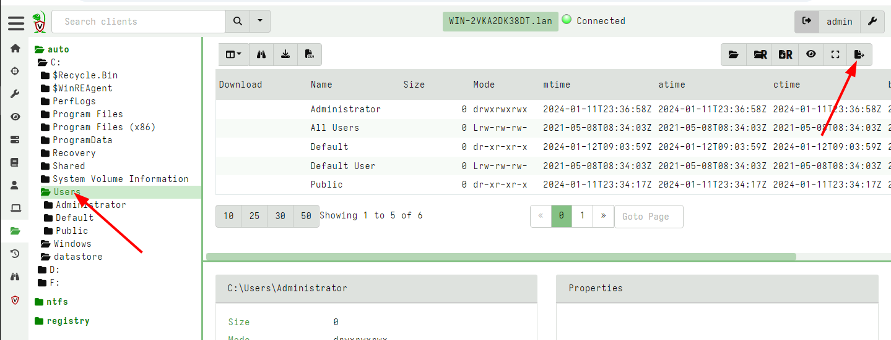
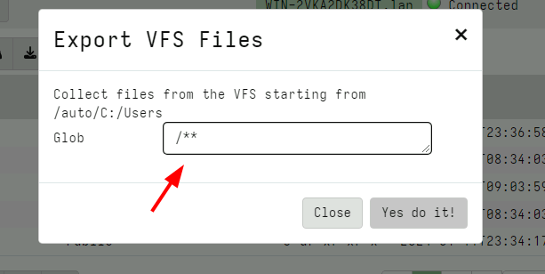
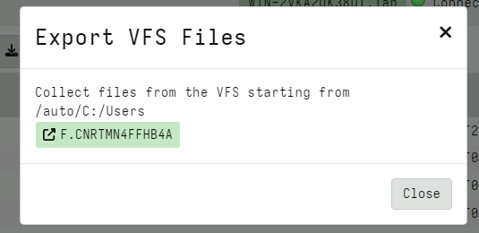
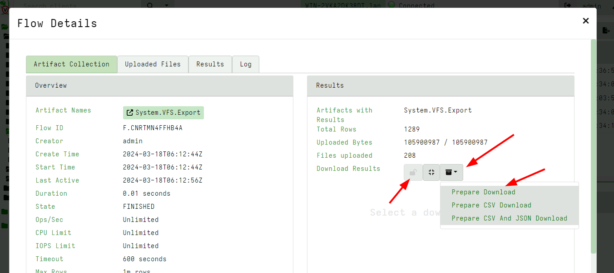
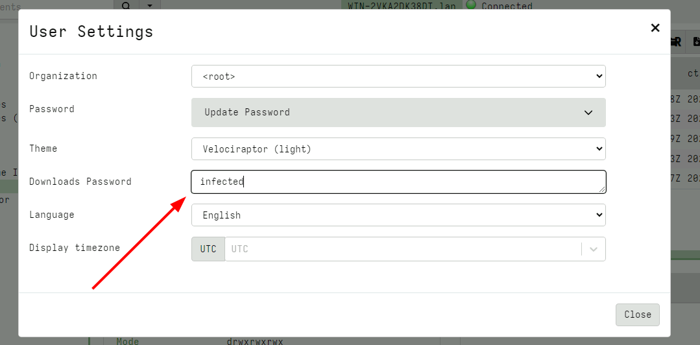

# How do I enable pasword protected downloads?

You can just export them from the GUI!   

Set the password in your user preferences you can enable password protected exports.   

1. Highlight the directory you want to export.  

  

2. Hit the export button - this will start a server collection to take a snapshot of the vfs - you can set any filtering globs (so for example dont export all the files maybe only *.exe).   

  

By default it just does ** which is everything under the directory.  
This makes a collection and adds a link to it.

    

3. Then click that and export like any other collection.  

    

4. Password can be set in the user preferences (the top right tile with the username).  
This will enable the lock feature of the zip export - make sure to click close button.

    

Tags: #password, #download, #gui
