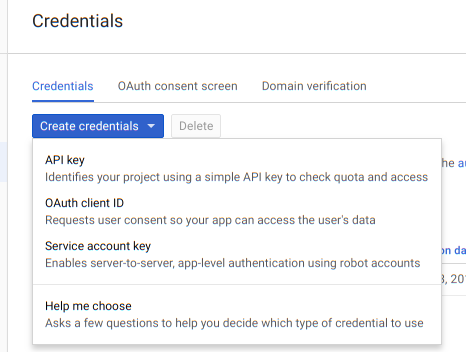

Many users choose to deploy Velociraptor in the cloud. This is a
convenient and reliable option. One of the advantages of cloud
deployment is the possibility of minting a proper SSL certificate
using the free Letsencrypt CA. This eliminates the bad certificate
browser warning seen in the Self Signed Deployment
method. Velociraptor is able to use the Letsencrypt protocol to obtain
and manage its own certificates (and automatically rotate them when
they expire).

For these deployment method, one requires
1. A DNS name is required - Let's Encrypt will not issue a certificate for an IP address.
2. Optionally the DNS name can be a Dynamic DNS name managed by Google Domains.
3. Optionally Authentication via SSO providers can be configured.

## Getting a domain name

An SSL certificate says that the DNS name is owned by the server which
presents it. Therefore SSL goes hand in hand with DNS. It is not
currently possible to get a Letsencrypt certificate for an IP address.

Therefore the first thing you need to do is to buy a DNS domain from
any provider. Once there, you need to set up a DNS A Record to point
at your Velociraptor server's external IP.

You can use a dynamic DNS client such as ddclient to update your
DNS->IP mapping dynamically. Alternative, Velociraptor directly
supports updating Google Domains Dynamic DNS so this is the easiest
option since it requires the least amount of configuration.

In this example we use Google Domains to purchase our domain, but any
other domain provider would work as well.

## Provisioning a Virtual Machine

Next we provision an Ubuntu VM from any cloud provider. Depending on
your deployment size your VM should be large enough. An 8 or 16Gb VM
should be sufficient for around 5-10k clients. Additionally we will
need sufficient disk space to hold the data we will collect. We
recommend to start with a modest amount of storage and then either
backup data as it gets collected or increase the storage volume as
needed.

{}

It is essential to ensure that inbound filtering ACLs allow our
virtual machine to receive connections over **both** ports 80 and 443.
When using SSL both the client communication **and** the GUI are served
over the same ports to benefit from SSL transport encryption. The
Letsencrypt protocol requires Letsencrypt's servers to connect to the
VM on port 80 - however the GUI itself will only be served over SSL.

{}

When we deploy our Virtual Machine we may choose either a static IP
address or allow the cloud provider to assign a dynamic IP address. We
typically choose a dynamic IP address and so we need to configure
Dynamic DNS.

Google Domains allows us to assign a dynamic DNS entry for our
domain by simply selecting a Dynamic DNS record:


After the dynamic address is created, we can get the credentials for
updating the IP address from the console. We will need these
credential during the interactive configuration process below.

## Configure Velociraptor to use autocert

Velociraptor can issue its own certificates. Using the guided
configuration wizard we may select this operation mode:

```text
$ ./output/velociraptor config generate -i
?
Welcome to the Velociraptor configuration generator
---------------------------------------------------

I will be creating a new deployment configuration for you. I will
begin by identifying what type of deployment you need.

  [Use arrows to move, space to select, type to filter]
  Self Signed SSL
> Automatically provision certificates with Lets Encrypt
```

By selecting this option the generated configuration file will ensure:

1. The server will fetch certificates automatically from Letsencrypt's
   servers when first accessed by the browser.

2. Both the Frontend and GUI will be served over the standard SSL port (443).

3. The GUI is therefore externally available (but protected over SSL)
   to the internet.

4. Clients will connect to the public DNS name over SSL.


{}

You must have both ports 80 and 443 publicly accessible by allowing
any inbound firewall rules! Letsencrypt uses both to issue
certificates. If you forgot to open port 80, Letsencrypt will fail to
issue the certificate and this might result in blocking the domain
name from getting an SSL certificate for several days. If you find
this happened, simply change the dyndns name and start again.

{}

The first time you connect to the GUI or to the frontend, the server
will obtain its own certificates from letsencrypt (it might take a
couple of seconds to respond the first time). You should have no SSL
warnings in your browser.


## Configuring Google OAuth SSO

In the previous sections we saw how to set up Velociraptor's GUI over
SSL. This is great, but we still need to create users and assign them
passwords manually. The trouble with user account management is that
we can not enforce 2 factor authentication, or any password policies
or any of the usual enterprise requirements for user account
management. It is also difficult for users to remember yet another
password for a separate system, and so might make the password easily
guessable.

Most enterprise systems require an SSO mechanism to manage user
accounts and passwords. Manual user account management simply does not
scale!

Velociraptor offers a number of choices of authentication providers:

1. Basic Authentication - this stores usernames and passwords in
   Velociraptor's own datastore.
2. Google, Azure or GitHub OAuth2 providers - Uses these providers to authenticate users via OAuth2.
3. OIDC - Uses the Open ID Connect protocol to support many IAM providers (e.g. Okta)

### OAuth Identity management

In the following we demonstrate how Velociraptor can be configured to
use Google's oauth mechanism to verify a user's identity. This
requires a user to authenticate to Google via their usual mechanism -
if their account requires 2 factor authentication, then users need to
log in this way.

Once the user authenticates to Google, they are redirected back into
the Velociraptor application with a token that allows the application
to request information about the user (for example, the username or
email address).


{}

OAuth is an authentication protocol. This means Velociraptor can be
pretty confident the user is who they claim they are. This does not
automatically grant them access to the application!  A Velociraptor
administrator must still manually grant them access before a user may
log in.

{}

Before we can use Google for Authentication, we need to register our
Velociraptor deployment as an OAuth App with Google.

### Registering Velociraptor as an OAuth application

The first step is to register Velociraptor as an OAuth app. We do this
by accessing the Google cloud console at
https://console.cloud.google.com . You will need to set up a cloud
account first and create a cloud project - even if you do not host
your server on Google's cloud platform.

Our ultimate goal is to obtain OAuth credentials to give our
Velociraptor app, but we have to have a few things set up
first. Navigate to `APIs and Services` in the GCP console and select
`Credentials` and the `OAuth Consent Screen` tab.


Further down we need to provide an authorized domain


In order to add an Authorized domain we need to *verify it*. Google's
help pages explain it further:

{}

**Authorized domains**: To protect you and your users, Google
   restricts your OAuth 2.0 application to using Authorized
   Domains. If you have verified the domain with Google, you can use
   any Top Private Domain as an Authorized Domain.

{}

In this example we assume that you purchased your domain with Google
domains which makes this step easier since it is already verified.

We can go back to the cloud console and `Create Credentials/OAuth
client ID`:



Now select `Web App` and we must set the `Authorized redirect URIs` to
`https://<Your Domain Name>/auth/google/callback` -
This is the URL that successful OAuth authentication will redirect
to. Velociraptor accepts this redirect and uses it to log the user on.


If all goes well the Google cloud console will give us a client ID and
a client secret.

### Generating configuration

To generate a self signed deployment start by running the `config
generate` command to invoke the configuration wizard

```sh
velociraptor config generate -i
```


The configuration wizard asks a number of questions and creates a
server and client configuration.


* What OS will the server be deployed on? This choice will affect the
  defaults for various options. Production deployments are typically
  done on a Linux machine (but the configuration can be generated on
  Windows).
* Path to the datastore directory: Velociraptor uses flat files for
  all storage. This path is where Velociraptor will write the
  files. You should mount any network filesystems or storage devices
  on this path.
* The public DNS name of the Frontend: The clients will connect to the
  server using this DNS name so it should be publically accessible
  (Note this is a DNS name and not a URL).
* Google OAuth2 Client ID and Secret are obtained from above.
* GUI Username or email address to authorize: The initial set of
  administrator accounts can be stored in the configuration file. When
  Velociraptor starts it will automatically add these accounts as
  administrators. When using SSO, Velociraptor does not use any
  passwords so only the user names will be recorded.


### User management

The OAuth flow ensures the user's identity is correct but does not
give them permission to log into Velociraptor. Note that having an
OAuth enabled application on the web allows anyone with a Google
identity to authenticate to the application but the user is still
required to be authorized explicitly. If a user is rejected, we can
see the following in the Audit logs:

```json
   {
     "level": "error",
     "method": "GET",
     "msg": "User rejected by GUI",
     "remote": "192.168.0.10:40570",
     "time": "2018-12-21T18:17:47+10:00",
     "user": "mike@velocidex.com"
   }
```

In order to authorize the user we must explicitly add them using the
velociraptor admin tool:

```text
$ velociraptor --config ~/server.config.yaml user add mike@velocidex.com
Authentication will occur via Google - therefore no password needs to be set.
```
Note that this time, Velociraptor does not ask for a password at all,
since authentication occurs using Google's SSO. If we hit refresh in
the browser we should be able to see the Velociraptor application dashboard.

We can see that the logged in user is authenticated by Google, and we
can also see the user's Google avatar at the top right for some more
eye candy :-).


{}

Velociraptor will retain its OAuth token for 24 hours. Each day users
will need to re-grant OAuth credentials. Therefore revoking a user
from the Google Admin console may take a full day to take effect. To
remove access sooner you should simply remove all permissions from the
user using `velociraptor user grant '{}'`.

{}

### Deploying to the server

Once a server configuration file is created it is most convenient to
create a server Debian package embedding the config file.

```sh
velociraptor.exe --config server.config.yaml debian server --binary velociraptor-v0.6.0-linux-amd64
```

The above command instructs Velociraptor to build a debian package for
the server using the linux binary specified. The result is a deb
package containing the velociraptor executable, the server
configuration file and relevant startup scripts.

{}
The Deb package contains the server configuration file, which contains all required key materials. Make sure the debian file is well protected since a compromise of the file will leak private key material enabling a MITM attack against Velociraptor.
{}

You can check the installation using `service velociraptor_server status`.

```bash
$ sudo dpkg -i velociraptor_0.3.0_server.deb
Selecting previously unselected package velociraptor-server.
(Reading database ... 384556 files and directories currently installed.)
Preparing to unpack velociraptor_0.3.0_server.deb ...
Unpacking velociraptor-server (0.3.0) ...
Setting up velociraptor-server (0.3.0) ...
Created symlink /etc/systemd/system/multi-user.target.wants/velociraptor_server.service → /etc/systemd/system/velociraptor_server.service.

$ sudo service velociraptor_server status
● velociraptor_server.service - Velociraptor linux amd64
   Loaded: loaded (/etc/systemd/system/velociraptor_server.service; enabled; vendor preset: enabled)
   Active: active (running) since Sun 2019-07-07 08:49:24 AEST; 17s ago
 Main PID: 2275 (velociraptor)
    Tasks: 13 (limit: 4915)
   Memory: 30.2M
   CGroup: /system.slice/velociraptor_server.service
           └─2275 /usr/local/bin/velociraptor --config /etc/velociraptor/server.config.yaml frontend

Jul 07 08:49:24 mic-Inspiron systemd[1]: Started Velociraptor linux amd64.
```

{}

You do not need to build the deb package on a Linux machine. If you
prefer to use Windows for your day to day work, you may build the deb
on your windows machine but you must specify the `--binary` flag to
the `debian server` command with a path to the linux binary. You can
obtain a copy of the linux binary from the Github releases page.

{}
