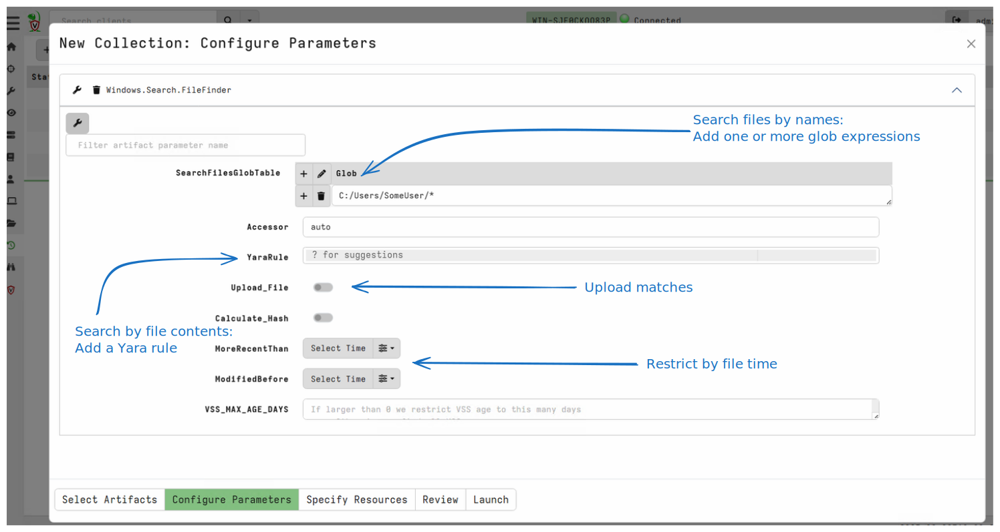
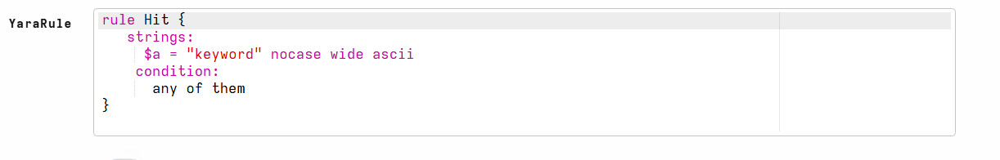

## Scenario

One of the most common operations in DFIR is searching for files
efficiently. When searching for a file, we may search by filename,
file content, size or other properties.

## Main takeaways

1. This technique can be used to find files on the endpoint.
2. Turning this into a hunt can search for a file across the entire fleet in minutes.
3. You can transfer the content of the file or just detect its presence.

## Steps to take

The most common artifacts to use are:

1. `Windows.Search.FileFinder` or `Linux.Search.FileFinder`
2. `Windows.NTFS.MFT`

## More details

The `Windows.Search.FileFinder` is the Swiss army knife of file
searching.

You can use the `File Finder` artifacts to find files by several criteria:

1. File names: Adding one or more Glob expressions (i.e. expressions
   with wildcards) will search for files by name.

2. In addition to the filename, you can restrict the file by times -
   by adding a time box (before and after times), only files with any
   of their timestamps inside the time box will be selected.

   This allows us to restrict questions to "only files added in the past week"

3. You can search file content by adding a Yara rule. Yara is a simple
   matching language allowing sophisticated search expressions.

   By pressing `?` inside the Yara editor, Velociraptor will suggest a
   Yara template you can use to get started.

4. Matching files can be uploaded to the server. NOTE: This may
   generate a lot of traffic so it is only suitable for a small number
   of very targeted matches. Alternatively simply calculate the hash
   of matching files.

The artifact also supports Windows Volume Shadow Copies, if
available. Velociraptor will automatically deduplicate VSS so only a
single file match will be reported, even if the same file exists in
multiple VSS snapshots - unless the file is changed between them.

{}

Although the artifact is named `File Finder`, the artifact can also be
used to search for registry keys and values. This is because
Velociraptor accesses files by way of an `accessor`. The accessor
abstracts access for files and file-like objects.

In Velociraptor the `registry` accessor makes the registry appear as a
filesystem: Registry keys appear as directories and Registry Values
appear as Files (with binary content).

This allows the File Finder to search the registry as well - simply
change the `Accessor` option from `auto` to `registry` to search the
registry. Remember, top level directory is the registry hive, for
example `HKLM`, or `HKEY_LOCAL_MACHINE`

{}

### Example: Detect persistence

Office executables like `WINWORD.exe` look for `AI.exe` under the
`%ProgramFiles%\Microsoft Office\root\<Office Version>` and
`%ProgramFiles(x86)%\Microsoft Office\root\<Office Version>`
directories.  An attacker may place a malicious `AI.exe` there in order
to have persistence whenever a user interacts with the Microsoft
Office Suite.  [1](https://twitter.com/laughing_mantis/status/1645268114966470662), [2](https://github.com/last-byte/PersistenceSniper/blob/main/PersistenceSniper/PersistenceSniper.psm1)

Search for file glob `C:\Program File*\Microsoft Office\root\Office*\ai.exe` and hash it.

### Example: Detect registry keys

The .NET DLLs listed in the `DOTNET_STARTUP_HOOKS` environment variable
are loaded into .NET processes at runtime.
[1](https://persistence-info.github.io/Data/dotnetstartuphooks.html),
[2](https://github.com/last-byte/PersistenceSniper/blob/main/PersistenceSniper/PersistenceSniper.psm1)

Solution: Change the Accessor to "registry" and search for the following globs.

1. `HKEY_USERS\*\Environment\DOTNET_STARTUP_HOOKS`
2. `HKEY_LOCAL_MACHINE\SYSTEM\CurrentControlSet\Control\Session Manager\Environment\DOTNET_STARTUP_HOOKS`

Select `Upload file` to view the content of the matching values.

### Example: Detect Mark of the Web files

When files are downloaded from the internet, browsers will add an
Alternate Data Stream (ADS) to the file called `Zone.Identifier`. This
stream will contain additional information about where the file was
downloaded from.

Solution:

1. Change the accessor to `ntfs` which will allow us to see
Alternate Data Streams (ADS).
2. Search for files containing the `Zone.Identifier` (ADS names are
   appended to the filename with a colon): `C:\Users\*\Downloads\**\*:Zone.Identifier`
3. Enable uploading to get the data.
4. You can preview the data within the GUI in the `Uploaded Files` tab.

{}

You can also use `Windows.NTFS.ADSHunter` or
`Exchange.Windows.Detection.ZoneIdentifier` to further parse the
contents of the `Zone.Identifier` stream.

{}

## Performance

Searching for files can be an expensive operation, using a lot of CPU
and IO resources on the end point. Some rules of thumb:

1. Searching by filename is fairly cheap.
2. It is better if you can narrow down the number of directories we
   have to scan. For example rather than search
   `C:/**/*:Zone.Identifier`, limit to search to only user files
   `C:/Users/**/*:Zone.Identifier`
3. It is expensive to search the content of files with a Yara rule.

   For example instead of searching for `C:/**` then applying a Yara
   rule looking for an executable, it is better to first narrow the
   glob to `C:/**/*.exe` and even time box it further. The File Finder
   artifact prioritizes cheaper operations like filename or
   modification time checks before attempting to apply a Yara scan.
