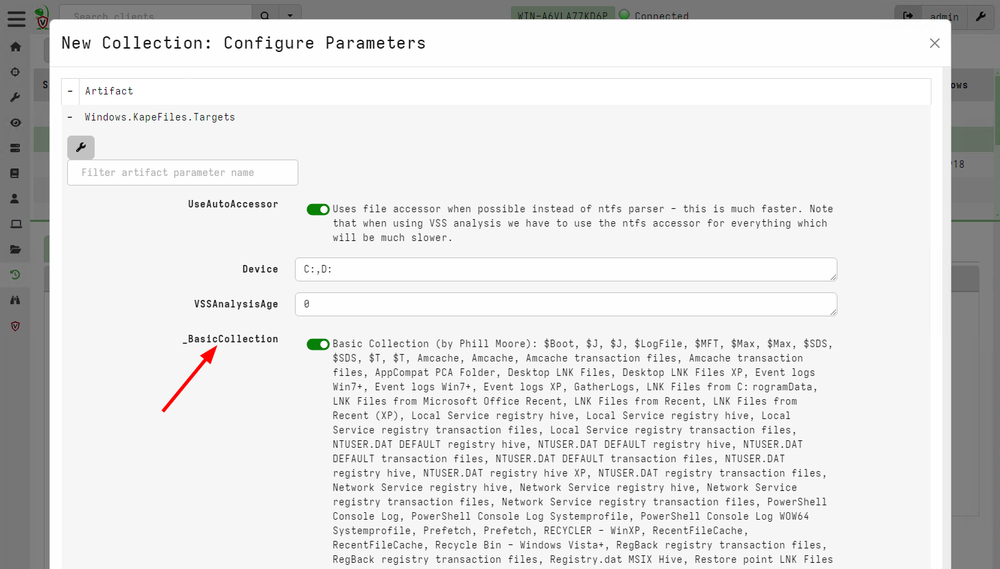
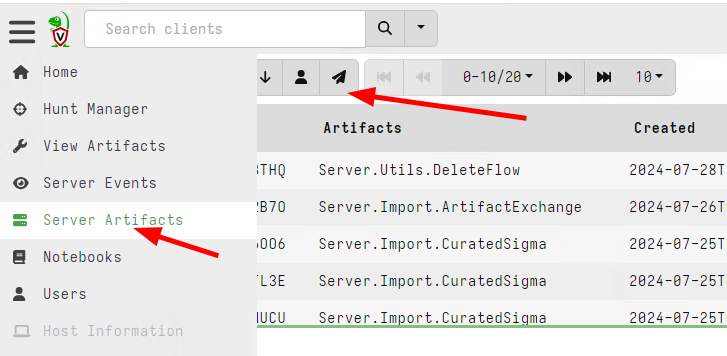
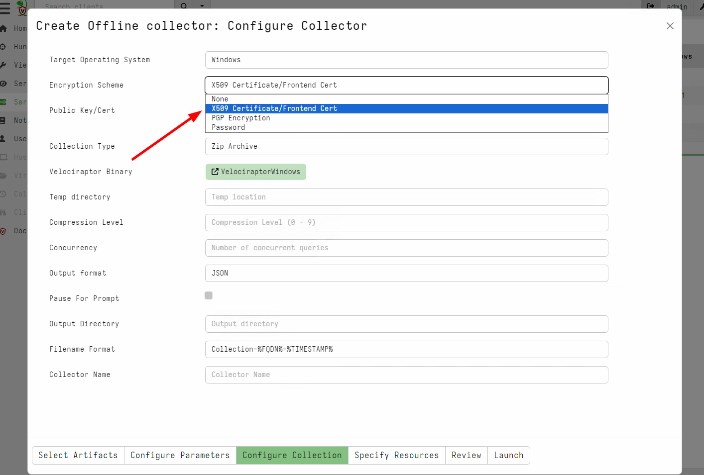

## Scenario

As a system administrator you have a high level of confidence a
certain endpoint is compromised. You wish to preserve critical
evidence while arranging for a more experienced DFIR professional to
examine the evidence.

## Main takeaways

1. This technique is a "shotgun" approach - it typically collects a
   lot of data.
2. Not very targeted.
3. Does not scale to many endpoints - use when very confident an
   endpoint is compromised.
4. DFIR skill required - LOW.

## Steps to take

Some common artifacts that are used in a preservation collection:

1. `Windows.KapeFiles.Targets` - collects files such as `$MFT`, log files etc.
2. `Windows.Memory.Acquisition` - collects a physical memory image.

### If Velociraptor is already installed on the endpoint

For collecting from a single endpoint

1. Search for the client you want to acquire from the main search screen.
2. Select `Collected Artifacts` from the sidebar, then select `New
   Collection` from the toolbar.
3. For Windows systems, select `Windows.KapeFiles.Targets`.
4. Select the `BasicCollection` or `Kape Triage` or `SANS Triage`
   targets. These targets select the most common raw files used by
   DFIR analysts.
5. This artifact can collect a large amount of data, we recommend to
   place resource limits to ensure that collection is not too
   excessive.

If you will have a number of endpoints to collect you can use a hunt
to combine the data together:

1. In the `Hunt Manager` screen, create a new hunt. Restrict the hunt
   to a label `acquisition`.
2. Proceed to collect the same artifacts as above
3. As the investigation proceeds, when you find a client that warrants
   a preservation collection, simply add a label `acquisition` to the
   client. The `Windows.KapeFiles.Targets` will be automatically
   scheduled on this client.
4. You can view all acquired clients in the hunt overview page, and
   create a large zip export of all preserved files.

{}

Make sure this hunt is restricted by labels! If it is not, it will be
scheduled on all clients and may result in a lot of data being
transferred to the server - this can result in the server's bandwidth
being saturated, disk becoming full or server becoming unresponsive.

If this happens you can stop the hunt in the GUI which will cancel all
in-flight collections and eventually recover the server's bandwidth.

{}

### If Velociraptor is not installed on the endpoint

If Velociraptor is not already installed on the endpoint, you can use
an `offline collector`. The Velociraptor `Offline Collector` is a
preconfigured version of Velociraptor which can run on the endpoint
and write all raw files into a ZIP archive.

You can use a number of methods to push the offline to collection to
the endpoint:

1. Use an existing EDR or endpoint security product to run the binary
   and retrieve the collected ZIP file.
2. Use Group Policy to schedule a task that runs the collector from a
   remote share.
3. Use `WinRM` or `PsExec` to run the collector remotely (by careful
   of pass the hash type attacks though).

We recommend using the X509 encryption scheme to store the raw data to
an encrypted container. This helps to protect it in transit.

You can also configure the offline collector to automatically upload
the collection to a cloud storage, such as `S3`, `Google Cloud
Storage` or a `Windows file share`.

## When to use this technique?

This technique should be used sparingly, usually targeting few
systems, as it can transfer a large amount of data.

Typically this technique is used when the endpoint is likely to be
destroyed (e.g. re-imaged) or become inaccessible in the near
future. The method is most suitable for preservation of raw data.

## When not to use this technique?

This workflow is not appropriate for triage. A triage workflow is
about discovering unknown compromised endpoints and therefore by
definition must be applied to a large number of endpoints. The
`Preserving Forensic Evidence` workflow can not be applied to a large
number of endpoints.

The traditional digital forensics workflow consists of the following
steps:

1. `Acquisition` step collects a large amount of raw data to a central
   server.
2. `Analysis` step applies parsers and various dedicated tools in a
   central "forensics workstation" on all the raw data collected.
3. `Interpretation` step involves examining the output from the
   various parsers to answer case specific questions.

Many newcomers to Velociraptor have been trained with this workflow
and try to apply it to Velociraptor.

However this centralist approach to digital forensics does not scale
in practice. When trying to apply this approach to a large network of
endpoints, users are often overwhelmed with data (it is almost a right
of passage for new Velociraptor users to completely fill their
server's disk because they tried to collect all the log files from all
the endpoints)

Velociraptor's philosophy is different:

1. Velociraptor considers the endpoint to be the ultimate source of truth.
2. Therefore we rarely need to fetch the raw data from the endpoint!
   Since Velociraptor can parse the raw data directly on the endpoint
   we prefer asking case relevant questions from the entire network
   directly.

To explain this point, let's consider an example where we want to know
if an executable file was recently downloaded onto the endpoint. We
will attempt to parse the USN Journal to answer this question.

The very traditional Digital Forensics process (i.e. back in the 90s)
would require acquiring a bit for bit disk image of the suspected
endpoint with a write blocker attached! Probably no-one does this any
more!

A more modern approach is to use a digital acquisition tool to copy
just the `C:\$Extend\$UsnJrnl:$J` file in it's entirety for
`Acquisition`, then apply a separate tool to parse the journal and
search for any files written to the disk with a `.exe` extension.

While this approach is better than acquiring the entire disk image
(Average disks are of the range of 1-2Tb these days), it still
requires collecting several hundred MB of data from each endpoint. If
you have 10,000 endpoints this quickly becomes intractable.

Velociraptor's approach is different: Since the endpoint is considered
the source of truth, we just directly run our analysis on the
endpoint. Collecting the `Windows.Forensics.Usn` artifact with a
`FileNameRegex` filter of `.exe$` will query each machine to parse
their own local copy of the USN journal to find all executables
directly.

We can collect this artifact using a hunt from the entire network at
once. Since each endpoint will be doing the analysis in parallel,
results will return in minutes regardless of how many endpoint there
are!

This is why we consider simple acquisition followed by central
analysis workflows to be inferior to directly collecting the right
artifacts.

You should use the `Preserving Forensic Evidence` workflow only on
systems that are known to have been compromised and you want to
preserve the raw files for some reason.

### Other considerations

When collecting raw files from the endpoint we need to make a tradeoff:

1. Collecting fewer files may miss some files that are needed later
   during analysis.
2. Collecting more files will result in larger collection.

Ultimately it is not possible to know in advance what type of evidence
may be relevant. For example, we might collect the `$MFT` in our
initial acquisition but subsequent analysis can show that certain
files are critical (e.g. files in the user's `Downloads` directory).

In a `Preserving Forensic Evidence` workflow we can not go back to the
source of truth and check the files in the `Downloads` directory!

Therefore it is always better to have Velociraptor already installed
on the endpoint so we can pivot during the analysis phase and get
additional information as required.
