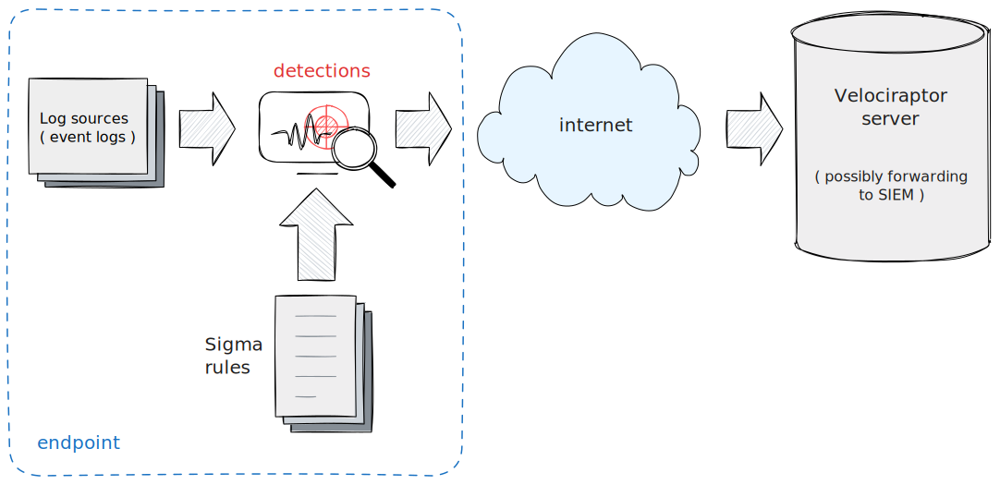
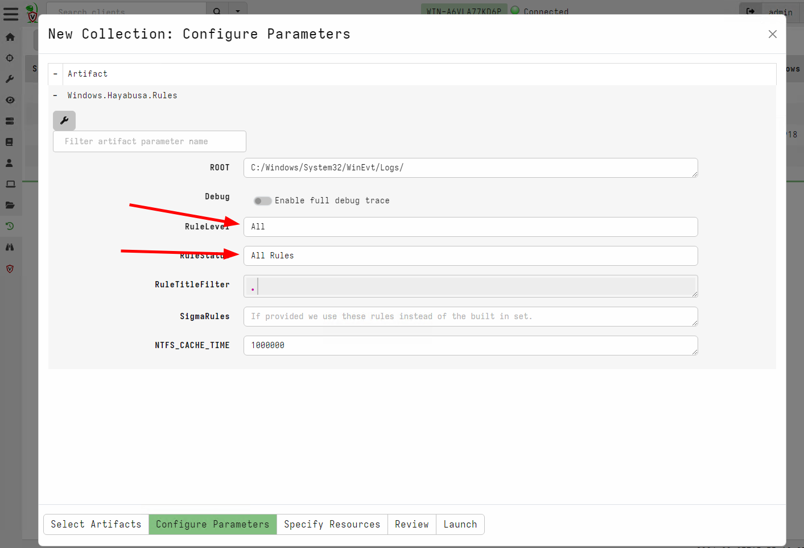
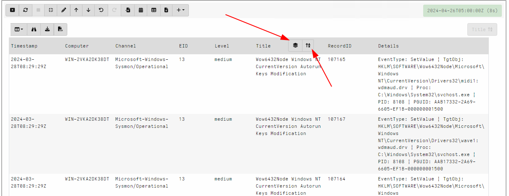
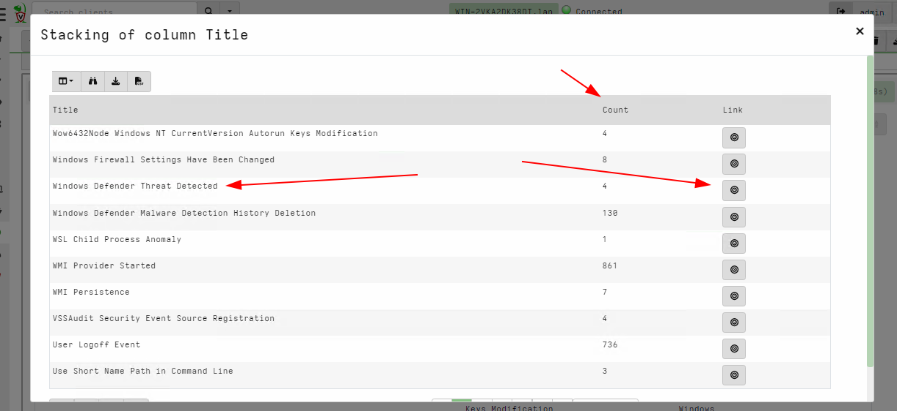

## Scenario

An endpoint is suspected of being compromised but you dont know
exactly what happened. You want to get an initial idea by examining
the logs on the actual endpoint.

## Main takeaways

1. This technique is similar to forwarding logs to a SIEM and applying
   signatures.
2. However we can choose very noisy signatures here
3. We use stacking to quickly categorize the types of activity that
   happens on the endpoint.

## Steps to take

Some common artifacts that are used for `Triaging Logs`

1. `Windows.Hayabusa.Rules` should be imported using `Server.Import.CuratedSigma`
2. `Exchange.Windows.EventLogs.Hayabusa` should be imported from the
   artifact exchange.

### Importing Windows.Hayabusa.Rules

1. Select the `Server Artifacts` from the sidebar.
2. Add a collection, search for `Server.Import.CuratedSigma` and
   import the `Windows.Hayabusa.Rules`. This will import the latest
   version of the artifact.

This artifact uses the built in `Sigma Engine` in Velociraptor. The
artifact packages the curated `Hayabusa` rules in a convenient
artifact. Rules are categorized by `RuleLevel` and `RuleStatus` which
generally try to balance how noisy a rule against its detection
efficacy.

Because we are trying to triage the endpoint, we actually want to see
all the hits, even if they are noisy. We will apply stacking later to
quickly triage the type of activity on the endpoint. So in this case
we should select to apply all the rules.

Once the artifact is collected from the endpoint we can stack the hits
in the GUI:

1. Update the notebook to remove the `LIMIT 50`. This will select all
   rows in one table. Typically there should be many thousands of
   rows because we added all the noisy rules.
2. Sort by the rule `Title`. Hover the mouse on the column header and
   click the `Sort` button.
3. Once the column is sorted, the stacking button should appear.

4. Clicking the stacking button will show a summary of the different
   rules matching and a count of how many times each rule made a hit.

5. Clicking on any of the rules navigates the table to the list of
   rules that actually hit.

Using this technique it is possible to quickly identify the types or
categories of activity on the endpoint and see the most suspicious
rules. Due to the stacking we dont need to review each individual hit,
but only the different types of rules.

For example, say we see a rule description a `PsExec` lateral
movement, we can quickly identify if `PsExec` is expected for this
environment, or does it represent a potential threat. If I identify
the rule as important, I can then review each instance to get more
information about what commands were run.

## Using the Exchange.Windows.EventLogs.Hayabusa

The `Exchange.Windows.EventLogs.Hayabusa` artifact is available in the
artifact exchange. This artifact uses an external binary `Hayabusa` to
evaluate the `Sigma` rules from the `Hayabusa` project.

Post processing and analysing the results from this artifact is
similar to the procedure described above.

## Discussion and limitations

This technique is similar to many SIEMs which forward event logs from
the endpoint and apply matching rules. There are some fundamental
differences though:

1. SIEMs typically only forward a small subset of logs since the more
   logs are collected the more data the SIEM backend needs to
   handle. Typically SIEMs forward logs such as `Sysmon Process
   Execution` but do not forward other logs for example `BITS Client
   Operational Logs`.

2. SIEM rules are also written to ensure they have a low false
   positive rate. This means that suspicious activity in one
   environment which is common in another setting, might not trigger a
   detection. By stacking on all noisy rules we get to decide for
   ourselves if a particular rule is acceptable for this environment.

   For example an administrator RDP login may be perfectly normal in
   some environments but a red flag in others!  SIEM detections are
   rarely tuned to the environment.

3. A SIEM may not be present or well tuned, in a particular
   environment. Running the `Sigma` log triaging workflow can
   compensate for the lack of a SIEM.

4. Data retention is different from a SIEM. Typically SIEMs only
   maintain logs for limited time (sometimes as low as a month). On
   the other hand log files are typically rotated based on size. This
   means that sometimes logs will be present on the endpoint for
   longer than in the SIEM, while other times the SIEM will contain
   logs that were already rotate on the endpoint.

5. Because this technique relies on locally stored logs, it is
   susceptible to logs being cleared by attackers.

## Real time monitoring

As an additional step you can enable the `Windows.Hayabusa.Monitoring`
artifact for real time detection of the same `Sigma` rules. This can
provide coverage for any future compromises
