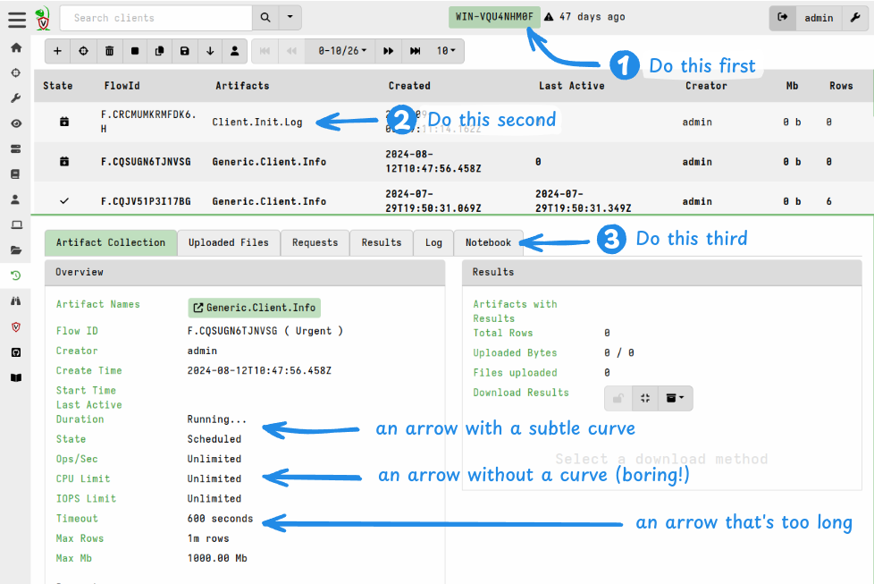
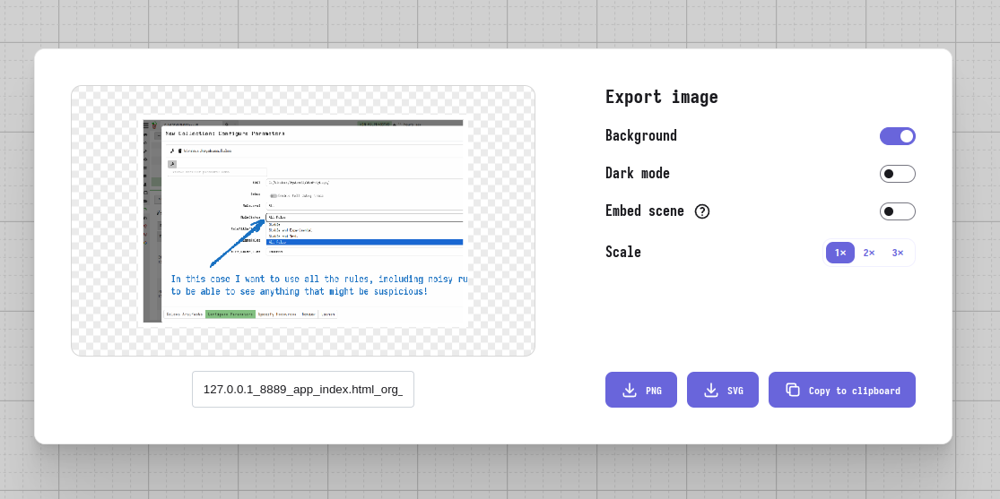

# Guidelines for creating image content

This document provides guidance for creating image content for the Velociraptor documentation.
It specifies some informal standards and gives some tool-specific advice with the goal of ensuring as much consistency as possible in our image content.

The guidance in this document is intended to:
- allow newcomers to get quickly "up to speed" in creating image content that is consistent with existing content on the website.
- centralize image content-related decisions.

---

* [Image categories](#image-categories)
* [Fonts](#fonts)
* [Colors](#colors)
* [Excalidraw object library](#excalidraw-object-library)
* [Screenshots](#screenshots)
  * [Screen size](#screen-size)
      * [Partial screens](#partial-screens)
        * [Framing](#framing)
      * [Full screens](#full-screens)
  * [Velociraptor theme](#velociraptor-theme)
  * [Annotations](#annotations)
      * [Arrows](#arrows)
      * [Numbered callouts](#numbered-callouts)
      * [Excalidraw-specific options](#excalidraw-specific-options)
* [Line diagrams](#line-diagrams)
* [Exporting images](#exporting-images)
  * [Formats and settings](#formats-and-settings)
  * [Fonts in SVG images](#fonts-in-svg-images)
  * [File size](#file-size)

---

## Image categories

Image content generally falls into one of these categories:

1. [Screenshots](#screenshots)
	- unannotated
	- annotated
2. [Line diagrams](#line-diagrams) (flow charts, sequence diagrams, etc.)
3. GIF animations (typically use for short video clips of things like terminal sessions)

For **annotated screenshots** and **line diagrams** we use Excalidraw because it's easy to use and it produces drawings with a realistic hand-drawn effect.
For annotated screenshots this aspect contrasts well with inorganic GUI elements, and in general it's humanistic and visually appealing.

For **unannotated screenshots** we use the PNG format since it has lossless compression which preserves the legibility in text in images of the Velociraptor GUI. There's no need to do anything fancy with these images. Just try to keep the size below 300KB if possible.

For **GIF animations** no standard exists yet.

## Fonts

The use of standard fonts is most relevant to **annoted screenshots** and **line diagrams**.

The official Excalidraw version (https://excalidraw.com) uses a default font named "Excalifont" which is very scrawly and therefore hard to read (as discussed [here](https://github.com/excalidraw/excalidraw/issues/2945)) as well as being too cartoonish for serious subject matter.

The default fonts in Excalidraw are not able to be changed without editing the application's source and running a local instance.
The Excalidraw developers have made no firm commitment to making custom fonts possible even though this is a highly requested feature.

As a workaround to this limitation we replace the fonts with our preferred ones in the SVG files that we export from Excalidraw.
This font substitution is done [automatically](https://github.com/Velocidex/velociraptor-docs/blob/947bb25a3d7cc6b4ac9d376db863f8a9db535ece/layouts/_default/_markup/render-image.html#L7) by the Hugo build process.

Excalidraw has provision for only 3 font variants at a time, so we assign them as follows:

| Excalidraw UI font name | CSS/SVG font family name | Velociraptor WOFF2 font file name | What we use it for |
|-------------------------|--------------------------|-----------------------------------|:------------------:|
| Hand-drawn              | Excalifont               | playpen-sans-v13-latin-500        |    Default font    |
| Normal                  | Nunito                   | playpen-sans-v13-latin-800        |    Heading font    |
| Code                    | Comic Shanns             | SVBasicManual                     |      Code font     |

Visually this is how our font allocations compare to the default ones:


In our case the hand-drawn font _is_ our default/normal font.
We assign our heading font to the provided "normal font" slot because Excalidraw doesn't have any options for bolding or italicizing fonts.

We host the font files at the following locations on our documentation site so that our SVG images can load them.

```
https://docs.velociraptor.app/fonts/playpen-sans-v13-latin-500.woff2

https://docs.velociraptor.app/fonts/playpen-sans-v13-latin-800.woff2

https://docs.velociraptor.app/fonts/SVBasicManual.woff2
```
For normal text we use the **Medium** font size. It's thickness corresponds closely to the thickness of lines and arrows set to **Extra Bold**.

## Colors

For **screenshot annotations** we use HTML `#228be6` for lines and text.
This is one of the colors in Excalidraw's built-in palette and it contrasts well with Velociraptor's light theme.
It's also light enough to be visible against dark backgrounds.

For pure **line diagrams** we use black for lines and text, with de-emphasized elements being grey.

Additional colors can be used to emphasize particular drawing objects.

The default Excalidraw color palette is well designed, so only use those colors.
This makes it easier to ensure that colors used in future images can be matched those used in the past.

## Excalidraw object library

This file is an Excalidraw library containing reusable shape objects for our drawings.

[library.excalidrawlib](library.excalidrawlib)

If you find or create objects that you think will be useful in future drawings then please add them to this library, save the changes and commit the updated version back to the `velociraptor-docs` repo.


## Screenshots

### Screen size

While we may do our daily work on screens with high display resolutions,
the documentation will likely be read on smaller displays or possibly even printed.
It needs to be legible on typical screens without a magnifying glass or zooming in.

Ideally we want screenshots in the documentation to have a comfortably low resolution such that text easily legible without any zooming.
This can be achieved by either:

- only showing the part of the screen that the user needs to see.
- using a constrained screen size for full-screen screenshots.

These are explained below.

#### Partial screens

##### Framing

When screenshotting only a part of the screen then it's important to anchor it by including some familiar element like part of the header or sidebar. Unless a previous screenshot has already provided that spacial/navigational context.


Capturing screenshots that show only part of the screen area are relatively straightforward and many tools are capable of doing this.

> [!TIP]
> A useful trick in Chrome Dev Tools is that you can right-click on a DOM element and capture an image of just that element.
>
> 

#### Full screens

When full screenshots are needed we can improve their legibility by simulating a smaller screen size.
The "dev tools" of modern browsers allows you to simulate arbitrary screen sizes, including many common phone screens.
Velociraptor's GUI is not a fully responsive web application but it's layout remains usable at quite small (by modern standards) screen resolutions.

For full screenshots use one of the following 2 sizes:

- 1280x960 (preferred)
- 1600x1200 (only if needed to show wide table content or some other specific reason)


*These particular constrained sizes can be configured as presets in Chrome's "dev tools" for quick access.*


### Velociraptor theme

For consistency, and to avoid confusing new users, we use a single GUI theme for all screenshots: the **Standard Docs** theme which is based on the default Velociraptor Light them but with some additional legibility tweaks.


### Annotations

#### Arrows

**Always add at least a slight curve to arrows.**
Hand-drawn arrows are never perfectly straight although Excalidraw will create them as such. You should make arrows slightly more convincingly hand-drawn by wiggling the grab handle in the middle of the arrow by a tiny amount - just enough to make it not dead straight. Of course arrows can also be more significantly curved for aesthetic or practical reasons.

**Arrows should not be too long.**
A good rule of thumb is that arrow lengths should never be longer than 1/3 of the width of the image.

Excalidraw has 2 types of arrowheads: we use the **open arrowhead**, not the triangular one.

#### Numbered callouts

To indicate a sequence of actions use numbered callouts.
These are available in our [Excalidraw object library](#excalidraw-object-library)


*Examples of arrows and numbered callouts*

The above example also shows that a semi-transparent rectangle can be placed behind text to make it more legible if it overlays a dark area of background.

- If you're using numbered callouts simply to indicate a navigation sequence then you may not need to add any descriptions.
- If the callout numbers are explained/referenced in your written content then descriptions in the image may be unnecessary.
- The arrow is also optional if the placement makes it's clear enough what the numbering is associated with. A good way to make this association clear is by drawing a square or rectangle around the element and placing the number so that it touches the shape.. Example below.


#### Excalidraw-specific options

One of the hidden benefits of Excalidraw is that it doesn't have too many settings.
This automatically leads to greater consistency.

For the line "**sloppiness**" setting we use the **"medium"** option, i.e. "artistic".
The "cartoonist" option produces divergent lines and in general is a bit too messy, so do not use that setting. We want humanized, but not messy (even though messy is fun!).

For line thickness ("**stroke width**") we use "**extra bold**" for annotation arrows, however this is subjective choice since line thickness is ultimately relative to the dimensions of the rendered image.


## Line diagrams

We also use Excalidraw for line diagrams. These can be drawn from scratch but Excalidraw also allows importing some Mermaid markdown which can be useful for quickly creating initial diagram structures.

The following image highlights the recommended Excalidraw settings for our diagrams. Generally these are similar to the settings for annotations but note the following differences:

- stroke width is **Bold** (not Extra Bold)
- stroke color is black (not blue)


The diagram heading is made bold by choosing the "Normal" font which is the same font as our "Hand-drawn" font but a bold variant. This is necessary because Excalidraw currently doesn't have any options for bolding or italicizing fonts.

## Exporting images

### Formats and settings



We export our images from Excalidraw to SVG format, and not to PNG.

When exporting images from Excalidraw we include "Background" which ensures that the background is not transparent. This option adds an opaque white background plus a small margin around it.

For SVG exports the Scale setting is irrelevant to quality: the embedded screenshot will be base64-encoded at it's original size, even if you've scaled the screenshot on the Excalidraw canvas. The image dimensions are related to the vector layer and if this is resized by the web server then the embedded raster image will be scaled to match.

When working in Excalidraw you should resize the screenshot so that it's comfortable to work with on the canvas at 100% zoom because this represents the view that the reader will see (without needing to zoom in).
When exported the SVG image will be sized at the dimensions of a bounding box around the elements on your canvas. The line thicknesses and font sizes are relative to your canvas.


Although it is possible to edit SVG images externally they cannot be imported back into Excalidraw.
So for annotated screenshots and block diagrams we save the `.excalidraw` file alongside the exported SVG or PNG image, using the same file basename, and check it in to the Git VCS.
This allows others to easily make changes in future since they can open the `.excalidraw` file in the Excalidraw web app.

Although the image may be reused in multiple places on the docs website, or in other Velociraptor repos such as presentations, we only need to keep *one instance* of the `.excalidraw` file. If you find yourself needing to edit a SVG image and there is no `.excalidraw` file alongside it, then you should be able to find it be doing a search of the repo for the base filename.

> [!NOTE]
> Regardless of the export format, remember to also save a copy of the drawing in Excalidraw format so that others can edit it in future, if necessary.
>

> [!NOTE]
> Annotated screenshots exported from Excalidraw as SVG images contain a base64-encoded copy of the screenshot. The saved `.excalidraw` file does too. So it is not necessary > to keep a copy of the original screenshot PNG.
>

### Fonts in SVG images

SVG files exported from Excalidraw.com contain subsetted base64 encoded fonts.

As mentioned previously, this font substitution is done [automatically](https://github.com/Velocidex/velociraptor-docs/blob/947bb25a3d7cc6b4ac9d376db863f8a9db535ece/layouts/_default/_markup/render-image.html#L7) by the Hugo build process.

*SVG font definitions as generated by Excalidraw.com*
```xml
  <defs>
    <style class="style-fonts">
      @font-face {
        font-family: Excalifont;
        src: url(data:font/woff2;base64,d09GMgA...zPM/Cg==);
          }
@font-face {
        font-family: Nunito;
        src: url(data:font/woff2;base64,d09GMgAB...oV3gpVKwbAA==);
          }
@font-face {
        font-family: Comic Shanns;
        src: url(data:font/woff2;base64,d09GMgABAAAA...uBAAA);
          }
    </style>

  </defs>
```

*SVG font definitions that we use to render our custom fonts on our website*
```xml
  <defs>
    <style class="style-fonts">
      @font-face {
        font-family: Excalifont;
        src: url("https://docs.velociraptor.app/fonts/playpen-sans-v13-latin-500.woff2");
      }
      @font-face {
        font-family: Nunito;
        src: url("https://docs.velociraptor.app/fonts/playpen-sans-v13-latin-800.woff2");
      }
      @font-face {
        font-family: Comic Shanns;
        src: url("https://docs.velociraptor.app/fonts/SVBasicManual.woff2");
      }
    </style>

  </defs>
```

We keep the font-family names unchanged because they are referenced throughout the SVG.
The names themselves are irrelevant as long as they match the intended font files.

### File size

If you've followed the advice in this document your image files should not be too large. However it's worth checking the file size and if it's over 300KB then it might be a sign that you've done something wrong.

Most image files should be around 300KB and should almost never be  greater than 500KB.
We prefer to have image files within these soft limits so that:
- they render reasonably quickly on the website
- the documentation repo doesn't become significantly larger than it needs to be.


