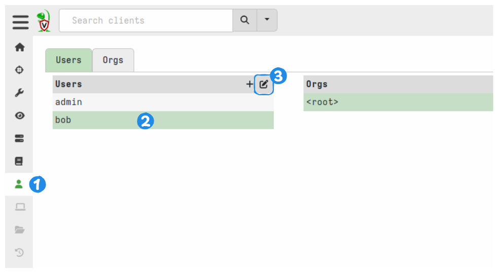

# Guidelines for creating image content

This document provides guidance for creating image content for the Velociraptor documentation.
It specifies some informal standards and gives some tool-specific advice with the goal of ensuring as much consistency as possible in our image content.

---

* [Image categories](#image-categories)
* [Fonts](#fonts)
* [Colors](#colors)
* [Excalidraw object library](#excalidraw-object-library)
* [Screenshots](#screenshots)
   * [Screen size](#screen-size)
      * [Partial screens](#partial-screens)
      * [Full screens](#full-screens)
   * [Velociraptor theme](#velociraptor-theme)
      * [Theme tweaks](#theme-tweaks)
   * [Annotations](#annotations)
      * [Arrows](#arrows)
      * [Numbered callouts](#numbered-callouts)
      * [Excalidraw-specific options](#excalidraw-specific-options)
* [Line diagrams](#line-diagrams)
* [Exporting images](#exporting-images)
   * [Formats and settings](#formats-and-settings)
   * [Fonts in SVG images](#fonts-in-svg-images)
   * [File size](#file-size)

---

## Image categories

Image content generally falls into one of these categories:

1. [Screenshots](#screenshots)
	- unannotated
	- annotated
2. [Line diagrams](#line-diagrams) (flow charts, sequence diagrams, etc.)

For **annotated screenshots** and **line diagrams** we use Excalidraw because it's easy to use and it produces drawings with a realistic hand-drawn effect.
For annotated screenshots this aspect contrasts well with inorganic GUI elements, and in general it's humanistic and visually appealing.

For **unannotated screenshots** we use the PNG format since it has lossless compression which preserves the legibility in text in images of the Velociraptor GUI. There's no need to do anything fancy with these images. Just try to keep the size below 300KB if possible.

## Fonts

The standard Excalidraw version uses a default font named Virgil which is too scrawly and therefore a bit hard to read (as discussed [here](https://github.com/excalidraw/excalidraw/issues/2945)).
The default fonts are not able to be changed without editing the application's source, and the Excalidraw developers have stated disinterest in make custom fonts possible.

Fortunately there exists a reasonably well-maintained fork which allows adding custom fonts
:   https://github.com/hulkbig/excalidraw-zh

It's very easy to set up a local instance:

1. clone the repo and cd to it
2. `yarn` to install
3. `yarn start` to start the web app
4. follow the link that it shows you (by default http://localhost:3000/).

Only 3 font variants are supported so we assign them as follows:

| Font file                  | What we use it for | Replaces Excalidraw's... |
| -------------------------- | :----------------: | :----------------------: |
| playpen-sans-v13-latin-500 |    Normal font     |       "Hand-drawn"       |
| playpen-sans-v13-latin-800 |    Heading font    |         "Normal"         |
| SVBasicManual              |     Code font      |          "Code"          |

We host the font files on the documentation site so that SVG images can load them.

The version of Excalidraw mentioned above can also load the fonts from these URIs:

```
https://docs.velociraptor.app/fonts/playpen-sans-v13-latin-500.woff2
```

```
https://docs.velociraptor.app/fonts/playpen-sans-v13-latin-800.woff2
```

```
https://docs.velociraptor.app/fonts/SVBasicManual.woff2
```


Unfortunately when the Excalidraw diagrams are exported to SVG the custom fonts are not included. But we can switch the fonts by doing a text search & replace on the SVG files. This is explained [here](#fonts-in-svg-images)

Try to use the **Medium** font size. It's thickness should correspond closely to the thickness of lines and arrows set to **Extra Bold**.

## Colors

For **screenshot annotations** we use HTML `#228be6` for lines and text.
This is one of the colors in Excalidraw's built-in palette and it contrasts well with Velociraptor's light theme.
It's also light enough to be visible against dark backgrounds.

For pure **line diagrams** we prefer to use black for lines and text, with de-emphasized elements being grey.
Other colors are fine though.
The default Excalidraw color palette is well designed, so preferably only use those colors.
This makes it easier to ensure that colors used in future match those used in the past.

## Excalidraw object library

This file is an Excalidraw library containing reusable shape objects for our drawings.


If you find or create objects that you think will be useful in future drawings then please add them to this library, save the changes and commit the updated version back to the repo.


## Screenshots

### Screen size

While we may do our daily work on screens with high display resolutions,
the documentation will likely be read on smaller displays or possibly even printed.
It needs to be legible on typical screens without a magnifying glass or zooming in.

Ideally we want screenshots in the documentation to have a comfortably low resolution.
This can be achieved by either:

- only showing the part of the screen that the user needs to see.
- using a constrained screen size for full-screen screenshots.

These are explained below.

#### Partial screens

Screenshots that show only part of the screen area are relatively straightforward.



A useful trick in Chrome Dev Tools is that you can right-click on a DOM element and capture an image of just that element.


#### Full screens

When full-size screenshots are needed we can improve their legibility by simulating a smaller screen size.
The "dev tools" of modern browsers allows you to simulate arbitrary screen sizes, including many common phone screens.
Velociraptor's GUI is not a fully responsive web application but it's layout remains usable at quite small screen resolutions.

For screenshots the following 2 sizes seem to work reasonably well:

- 1280x960 (first choice)
- 1600x1200 (sometimes needed to show wide table content)


*These particular constrained sizes can be configured as presets in Chrome's "dev tools" for quick access.*

### Velociraptor theme

For consistency in the documentation we should use a single GUI theme for all screenshots
:   the Velociraptor Light theme which is the default for new installations.

#### Theme tweaks

While screenshots do need to depict the actual application UI, it's reasonable to tweak some aspects to make the screenshots a bit clearer for documentation purposes.
These may include:
1. using a slightly heavier font weight: 500 rather than 400. On Windows the fonts seem to render slightly lighter for some unknown reason.
2. using pure black or white as the text color instead of lower contrast tones.
3. reducing the opacity of the modal backdrop so that items in the background are not excessively dimmed
4. deleting distracting elements from the DOM if necessary.
5. adding a glow effect via CSS to emphasize a specific element.

Points 1-3 can be patched into the GUI's CSS and compiled to make a documentation-specific binary. A patch is provided in this folder named `documentation_tweaks_{commit_id}.patch`

A glow effect (point 5) around GUI elements can be achieved by applying this CSS to the DOM elements in "dev tools".
Background color may be turned off if it isn't needed or produces a bad result.
Z-index is only sometimes needed for elements such as buttons that already have a z-index property set.

```css
box-shadow: 0px 0px 10px 5px rgba(34,139,230,0.9);
background-color: rgba(34,139,230,0.9);
z-index: 1000;
```


*Example: applying a glow effect to a DOM element*


*Example of random elements highlighted with a glow effect*

### Annotations

#### Arrows

Add at least a slight curve to arrows.
Even if you don't need the arrow to be curved just wiggle the grab handle in the middle of the arrow to make it not dead straight.

Try not to make arrows too long. A good rule of thumb is that arrow lengths should be less than 1/3 of the width of the image.

Excalidraw has 2 types of arrowheads: we use the **open arrowhead**, not the triangular one.

#### Numbered callouts

To indicate a sequence of actions use numbered callouts.
These are available in our [Excalidraw object library](#excalidraw-object-library)

If you're using numbered callouts simply to indicate a navigation sequence then you may not need to add any descriptions.

If the callout numbers are explained/referenced in your written content then descriptions in the image are unnecessary.

The arrow is also optional if the placement makes it's clear enough what the numbering is associated with.
A good way to make this association clear is by adding a glow effect to the GUI element, as explained previously, and place the number close to it.


*Examples of arrows and numbered callouts*

The above example also shows that a semi-transparent rectangle can be placed behind text to make it more legible if it overlays a dark area of background.
#### Excalidraw-specific options

One of the hidden benefits of Excalidraw is that it doesn't have too many settings.
This automatically leads to greater consistency.

For the line "**sloppiness**" setting we use the **"medium"** option, i.e. "artistic". The "cartoonist" option produces divergent lines and in general is a bit too messy. We want humanized, not messy (even though messy is fun!).

For line thickness ("**stroke width**") we use "**extra bold**" for annotation arrows, but this is subjective choice, since line thickness is ultimately relative to the dimensions of the rendered image.
The "extra bold" line thickness is what we want to achieve when the screenshot on the canvas is at an approximate 1:1 ratio (i.e. sized similar to the orginal source) unzoomed.

If you want really thick lines or huge fonts then overlay them on a small (resized) background image. 🙂


## Line diagrams

We also use Excalidraw for line diagrams. These can be drawn from scratch but Excalidraw also allows importing some Mermaid markdown which can be useful for quickly creating initial diagram structures.

The following image highlights the recommended Excalidraw settings for our diagrams. Generally these are similar to the settings for annotations but note the following differences:

- stroke width is **Bold** (not Extra Bold)
- stroke color is black (not blue)


The diagram heading is made bold by choosing our #2 font which is the same font as our #1 font but a bold variant. This is necessary because Excalidraw doesn't have any options for bolding or italicizing fonts.

## Exporting images

### Formats and settings

When exporting images from Excalidraw we include "Background" which encodes the screenshot (if there is one) plus a small margin around it. For line diagrams this option creates an opaque white background plus a small margin.

The Scale setting is a bit confusing:

- If you've inserted a screenshot and not resized it, then export it to PNG with Scale=1x, this will produce an image that is about 1/2 the size of the original. For that reason either resize the image on the canvas to approximately it's original size or else choosing Scale=2x for the export will produce an approximate 1:1 of the original size. In other words the Scale setting is relative to the size of the image on your screen.
- For SVG exports the Scale setting is irrelevant: it will base64-encode the screenshot at it's original size, even if you've scaled the screenshot on the Excalidraw canvas.

Given the above, SVG exports are the better option. An additional benefit is that the included screenshot is not re-encoded which would inherently degrade quality by a small amount. While the base64 encoding does cause a small size increase, the original PNG compression is preserved.

This means that if you're going to export to SVG then resizing the imported screenshot has no negative impact on the output size or quality. And in that case you can freely resize the screenshot so that it's comfortable to work with on the canvas at 100% zoom.

In all cases the line thickness and font sizes are relative to your canvas.


Annotated screenshots exported from Excalidraw as SVG images contain a base64-encoded copy of the screenshot so it is not necessary to save this as a separate PNG.

Although it is possible to edit SVG images externally they cannot be imported back into Excalidraw.
So for annotated screenshots and block diagrams we save the `.excalidraw` file alongside the exported SVG or PNG image, using the same file basename.
This allows others to easily make changes in future.
If the image is reused in multiple places on the docs website (or other Velociraptor repos such as presentations) we only need to keep *one instance* of the `.excalidraw` file.

> [!NOTE]
> Regardless of the export format, remember to also save a copy of the drawing in Excalidraw format so that others can edit it in future, if necessary.
>

### Fonts in SVG images

Excalidraw's exported SVG images render correctly in Chrome-based web browsers (at minimum) but not in desktop applications such as Inkscape or Krita.
This makes altering these images difficult, however since SVG is a text format we can tweak things without too much effort.

We do need to do this for font links because Excalidraw doesn't (yet) put links to the custom fonts inside the SVG files. Instead it adds links to the default fonts served from `exclidraw.com`, which is probably done to make the exported SVGs portable.

```xml
  <defs>
    <style class="style-fonts">
      @font-face {
        font-family: "Virgil";
        src: url("https://excalidraw.com/Virgil.woff2");
      }
      @font-face {
        font-family: "Cascadia";
        src: url("https://excalidraw.com/Cascadia.woff2");
      }
      @font-face {
        font-family: "Assistant";
        src: url("https://excalidraw.com/Assistant-Regular.woff2");
      }
    </style>

  </defs>
```
*SVG font definitions as generated by Excalidraw*

```xml
  <defs>
    <style class="style-fonts">
      @font-face {
        font-family: "Virgil";
        src: url("https://docs.velociraptor.app/fonts/playpen-sans-v13-latin-500.woff2");
      }
      @font-face {
        font-family: "Cascadia";
        src: url("https://docs.velociraptor.app/fonts/playpen-sans-v13-latin-800.woff2");
      }
      @font-face {
        font-family: "Assistant";
        src: url("https://docs.velociraptor.app/fonts/SVBasicManual.woff2");
      }
    </style>

  </defs>
```
*SVG font definitions that are needed to render our custom fonts*

We keep the font-family names unchanged because they are referenced throughout the SVG. We don't care what their names are, as long as they work.

### File size

If you've followed the advice in this document your image files should not be too large. However it's worth checking the file size and if it's over 300KB then it might be a sign that you've done something wrong.

Most image files should be <300KB and should almost never be >500KB. We want files to stay within these soft limits so that:
- they render reasonably quickly on the website
- the documentation repo doesn't become significantly larger than it needs to be.


